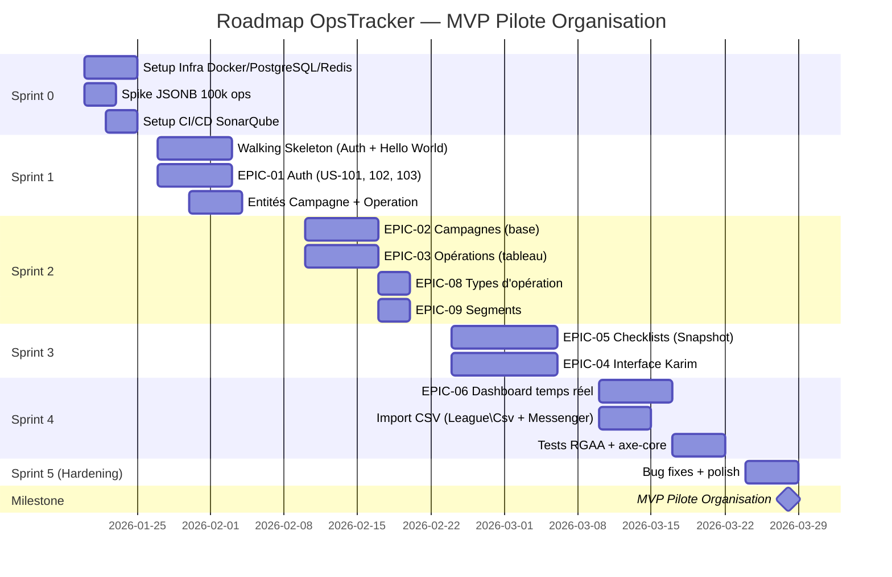

# P5 - Plan d'Implémentation (Roadmap)

━━━━━━━━━━━━━━━━━━━━━━━━━━━━━━━━━━━━━━━━━━━━━━━ 🚀 **PLAN D'IMPLÉMENTATION — OpsTracker MVP** Hypothèse équipe : **1 personne (Dev + Sponsor/PO) assistée par IA** — Mode "Benevolent Dictator" Durée estimée MVP : **5 Sprints (~10 semaines)** Date de lancement : 20 janvier 2026 Livraison MVP cible : 28 mars 2026 ━━━━━━━━━━━━━━━━━━━━━━━━━━━━━━━━━━━━━━━━━━━━━━━

---

## Synthèse Exécutive



---

## 1. Prérequis & Sprint 0 (Setup)

**Durée** : 5 jours (20-24 janvier 2026) **Objectif** : Tout ce qui doit être prêt AVANT de coder la US-001

### 🛠️ Infrastructure

|Action|Responsable|Délai|Statut|
|---|---|---|---|
|Provisioning serveur Docker Organisation|Ops/Marc|J+3|⬜|
|Setup `docker-compose.yml` (Nginx + PHP-FPM + PostgreSQL 17 + Redis 7)|Dev|J+2|⬜|
|Certificat SSL interne déposé|Marc|J+1|⬜|
|Fichier `.env.local` avec secrets (`DB_PASSWORD`, `APP_SECRET`)|Dev|J+2|⬜|
|Volumes Docker persistants configurés|Dev|J+2|⬜|

### 🔑 Accès & Comptes

|Action|Responsable|Délai|Statut|
|---|---|---|---|
|Dépôt Git créé (GitLab interne ou GitHub)|Dev|J+1|⬜|
|Accès SSH serveur Organisation|Marc|J+1|⬜|
|Bundle AM Symfony récupéré (si disponible)|Dev|J+3|⬜|

### 🔬 Spike Technique Critique

|Spike|Objectif|Critère de succès|Délai|
|---|---|---|---|
|**JSONB 100k ops**|Valider performance dashboard|Requête agrégation < 500ms|J+5|
|**Index GIN**|Valider recherche JSONB|Recherche sur champ custom < 100ms|J+5|

```sql
-- Script de spike à exécuter
CREATE TABLE operation_test (
    id SERIAL PRIMARY KEY,
    custom_data JSONB DEFAULT '{}'
);

CREATE INDEX idx_test_jsonb ON operation_test USING GIN (custom_data);

-- Insérer 100 000 lignes simulées
INSERT INTO operation_test (custom_data)
SELECT jsonb_build_object(
    'matricule', 'MAT' || i,
    'poste', 'PC' || i,
    'bureau', 'B' || (i % 100)
)
FROM generate_series(1, 100000) AS i;

-- Test performance
EXPLAIN ANALYZE
SELECT status, COUNT(*) 
FROM operation_test 
GROUP BY custom_data->>'bureau';
```

**⚠️ GO/NO-GO** : Si le spike échoue (>500ms), activer le plan B (pagination obligatoire dès 10k ops).

### 📐 Design

|Action|Responsable|Délai|Statut|
|---|---|---|---|
|Wireframes P3.4 disponibles|UX/BA|✅|Fait|
|Design Tokens RGAA (couleurs, contrastes) définis|UX|J+5|⬜|
|Maquettes HD Figma (Dashboard + Terrain Karim)|UX|J+10|⬜ Optionnel|

### 🔧 Qualité Code

|Action|Responsable|Délai|Statut|
|---|---|---|---|
|SonarQube configuré sur CI/CD|Dev|J+5|⬜|
|PHPStan niveau 5 minimum|Dev|J+3|⬜|
|Template `.php-cs-fixer.php`|Dev|J+2|⬜|

---

## 2. Stratégie de Découpage (Sprints)

### 🏃 Sprint 1 : Le "Walking Skeleton"

**Dates** : 27 janvier — 7 février 2026 (2 semaines) **Objectif** : Prouver que la stack P4.2 fonctionne de bout en bout (Front → API → DB)

|#|Ticket|Epic|US|Effort|Dépendances|
|---|---|---|---|---|---|
|1|Setup projet Symfony 7.4 + bundles|Infra|—|M|Sprint 0|
|2|Pipeline CI/CD (build + deploy staging)|Infra|—|M|Git repo|
|3|**US-101** : Se connecter à l'application|EPIC-01|MVP|M|Entité User|
|4|**US-102** : Se déconnecter|EPIC-01|MVP|S|US-101|
|5|**US-103** : Créer un utilisateur (Admin)|EPIC-01|MVP|M|US-101, EasyAdmin|
|6|Entité `Campagne` + Repository|Core|—|S|—|
|7|Entité `Operation` avec JSONB + index GIN|Core|—|M|Spike validé|
|8|**Walking Skeleton** : Créer 1 campagne "Hello World" → voir 1 opération|E2E|—|S|US-101 + Entités|

**Definition of Done Sprint 1** :

- [ ] Un utilisateur peut se connecter / se déconnecter
- [ ] Un admin peut créer un utilisateur via EasyAdmin
- [ ] Une campagne "Test" avec 1 opération existe en BDD
- [ ] Déploiement automatique sur environnement staging fonctionnel

**Risques Sprint 1** :

|Risque|Prob.|Mitigation|
|---|---|---|
|Bundle AM Symfony non disponible|Moyenne|Architecture standalone compatible (ADR-001)|
|Problèmes permissions Docker|Faible|Tester volume mounts dès J+1|

---

### 🏃 Sprint 2 : Les Fondations Métier

**Dates** : 10 — 21 février 2026 (2 semaines) **Objectif** : Sophie peut créer et gérer ses campagnes et opérations

|#|Ticket|Epic|US|Effort|Dépendances|
|---|---|---|---|---|---|
|1|**US-201** : Voir la liste des campagnes|EPIC-02|MVP|S|Entité Campagne|
|2|**US-202** : Créer une nouvelle campagne|EPIC-02|MVP|M|US-201|
|3|**US-205** : Voir les détails d'une campagne|EPIC-02|MVP|S|US-201|
|4|**US-206** : Clôturer/archiver une campagne|EPIC-02|MVP|S|US-205|
|5|**US-301** : Voir le tableau des opérations|EPIC-03|MVP|L|Entité Operation|
|6|**US-303** : Filtrer les opérations|EPIC-03|MVP|M|US-301|
|7|**US-304** : Modifier le statut (édition inline)|EPIC-03|MVP|M|Symfony Workflow|
|8|**US-306** : Ajouter une opération manuellement|EPIC-03|MVP|M|US-301|
|9|**US-801** : Créer un type d'opération|EPIC-08|MVP|M|JSONB schéma|
|10|**US-905** : Créer/modifier des segments|EPIC-09|MVP|S|Entité Segment|
|11|**US-906** : Voir progression par segment (base)|EPIC-09|MVP|S|US-905|
|12|Symfony Workflow : Config statuts dynamiques|Core|—|L|ADR-003|

**Definition of Done Sprint 2** :

- [ ] Sophie peut créer une campagne avec type d'opération
- [ ] Sophie peut voir/filtrer le tableau des opérations
- [ ] Sophie peut modifier le statut d'une opération inline
- [ ] Les segments sont créables et visibles
- [ ] Workflow des statuts fonctionnel (transitions validées)

**T-Shirt Sizing Sprint 2** :

|Taille|US concernées|
|---|---|
|S (1-2j)|US-201, US-205, US-206, US-905, US-906|
|M (3-4j)|US-202, US-303, US-304, US-306, US-801|
|L (5-7j)|US-301, Symfony Workflow|

---

### 🏃 Sprint 3 : Le Cœur du Réacteur (Karim)

**Dates** : 24 février — 7 mars 2026 (2 semaines) **Objectif** : Karim a son interface terrain, les checklists fonctionnent

|#|Ticket|Epic|US|Effort|Dépendances|
|---|---|---|---|---|---|
|1|Entité `ChecklistTemplate` + version|Core|—|M|—|
|2|Entité `ChecklistInstance` + Snapshot Pattern|Core|—|L|`myclabs/deep-copy`|
|3|**US-501** : Cocher une étape de checklist|EPIC-05|MVP|M|Snapshot Pattern|
|4|**US-502** : Voir la progression de la checklist|EPIC-05|MVP|S|US-501|
|5|**US-503** : Associer une checklist à une opération|EPIC-05|MVP|M|US-501|
|6|**US-401** : Voir "Mes interventions" (Karim)|EPIC-04|MVP|M|US-301|
|7|**US-402** : Ouvrir le détail d'une intervention|EPIC-04|MVP|S|US-401|
|8|**US-403** : Changer le statut (Karim)|EPIC-04|MVP|M|Workflow|
|9|**US-404** : Terminer et passer au suivant|EPIC-04|MVP|S|US-403|
|10|Tests RGAA : Touch targets 44x44px, contraste 4.5:1|QA|—|M|Interface Karim|

**Definition of Done Sprint 3** :

- [ ] Karim voit ses interventions du jour dès connexion
- [ ] Karim peut cocher les étapes de sa checklist
- [ ] La progression se met à jour instantanément (Turbo Streams)
- [ ] Les checklists "in progress" sont protégées (Snapshot Pattern validé)
- [ ] Touch targets RGAA respectés (44x44px minimum)

**⚠️ Attention Sprint 3** :

- **Snapshot Pattern** est le composant le plus technique du MVP
- Prévoir 2 jours de buffer pour intégration `deep-copy` + tests

---

### 🏃 Sprint 4 : Dashboard & Imports

**Dates** : 10 — 21 mars 2026 (2 semaines) **Objectif** : Sophie pilote sa campagne sans consolidation manuelle

|#|Ticket|Epic|US|Effort|Dépendances|
|---|---|---|---|---|---|
|1|**US-601** : Dashboard temps réel (4 widgets)|EPIC-06|MVP|L|Turbo Streams + Polling|
|2|**US-602** : Progression par segment|EPIC-06|MVP|M|US-601, US-905|
|3|Import CSV sync (<2000 lignes)|Core|—|M|`league/csv`|
|4|Import CSV async (>2000 lignes)|Core|—|L|Symfony Messenger|
|5|Tests d'intégration E2E|QA|—|M|—|
|6|Tests RGAA axe-core automatisés|QA|—|M|CI/CD|
|7|Tests manuels NVDA + Firefox|QA|—|M|—|
|8|Audit `auditor-bundle` intégré|Core|—|S|—|

**Definition of Done Sprint 4** :

- [ ] Sophie voit son dashboard avec 4 widgets temps réel
- [ ] Import CSV fonctionne jusqu'à 100k lignes (async)
- [ ] Tests axe-core passent à 100% sur pages critiques
- [ ] Audit trail fonctionne sur toutes les modifications

**Risques Sprint 4** :

|Risque|Prob.|Mitigation|
|---|---|---|
|Turbo + NVDA incompatibilité|Haute|Fallback polling seul si échec|
|Performance polling 30s sur 100 users|Moyenne|Cache Redis agressif|

---

### 🏃 Sprint 5 : Hardening (Buffer)

**Dates** : 24 — 28 mars 2026 (1 semaine) **Objectif** : Stabiliser le MVP pour le pilote Organisation

|#|Ticket|Type|Effort|
|---|---|---|---|
|1|Bug fixes critiques (P0)|Fix|Variable|
|2|Bug fixes majeurs (P1)|Fix|Variable|
|3|Documentation utilisateur minimale|Doc|M|
|4|Runbook déploiement production|Doc|S|
|5|Tests de charge (50 users simultanés)|QA|M|
|6|Revue code finale + dette technique|QA|M|

**Definition of Done Sprint 5** :

- [ ] 0 bug critique ouvert
- [ ] <5 bugs majeurs ouverts (documentés)
- [ ] Documentation utilisateur disponible (PDF 10 pages max)
- [ ] Runbook de déploiement validé

---

## 3. Definition of Done (DoD) & Qualité

Pour qu'un ticket passe en "Terminé" :

|Critère|Obligatoire MVP|
|---|:-:|
|Code mergé sur `main` sans conflit|✅|
|Tests unitaires passants (coverage > 60%)|✅|
|Tests fonctionnels Behat sur US MVP|✅|
|Critères d'acceptance (P4.1 BDD) validés|✅|
|Déployé en environnement staging|✅|
|Review par sponsor (PO) validée|✅|
|Pas de régression PHPStan niveau 5|✅|
|Tests axe-core passants (RGAA)|✅|
|Documentation inline (PHPDoc)|⬜ Nice to have|

---

## 4. Chemin Critique & Dépendances

**Attention : ces points peuvent bloquer tout le projet**

|Bloqueur Potentiel|Impact|Sprint|Mitigation (Qui fait quoi ?)|
|---|---|---|---|
|**Serveur Organisation non provisionné**|Bloque Sprint 0|S0|Marc provisionne J+1, plan B = VM locale dev|
|**Spike JSONB échoue**|Bloque architecture|S0|Pagination aggressive dès 10k ops|
|**Bundle AM indisponible**|Impact Auth|S1|Architecture standalone (déjà prévu)|
|**Symfony Workflow complexité**|Bloque S2|S2|Pattern fallback état machine simple|
|**Snapshot Pattern (deep-copy)**|Bloque S3|S3|Prévoir 2j buffer, tests TDD|
|**Turbo + NVDA incompatible**|Bloque RGAA|S4|Fallback polling pur (sans Turbo)|
|**Import 100k lignes timeout**|Bloque adoption|S4|Messenger async obligatoire|

```mermaid
graph LR
    subgraph S0["Sprint 0"]
        A[Serveur Docker] --> B[PostgreSQL + Redis]
        B --> C[Spike JSONB]
    end
    
    subgraph S1["Sprint 1"]
        C --> D[Entités core]
        D --> E[Auth Symfony]
        E --> F[Walking Skeleton]
    end
    
    subgraph S2["Sprint 2"]
        F --> G[Campagnes]
        G --> H[Opérations]
        H --> I[Symfony Workflow]
    end
    
    subgraph S3["Sprint 3"]
        I --> J[Checklists Snapshot]
        J --> K[Interface Karim]
    end
    
    subgraph S4["Sprint 4"]
        K --> L[Dashboard]
        L --> M[Import CSV]
        M --> N[Tests RGAA]
    end
    
    N --> O{MVP OK?}
    
    style A fill:#FFE0B2
    style C fill:#FFE0B2
    style J fill:#FFCDD2
    style N fill:#FFCDD2
```



**Légende** : 🟠 Points critiques, 🔴 Risques élevés

---

## 5. Matrice RACI Simplifiée

> **Mode "Benevolent Dictator"** : Une seule personne cumule tous les rôles décisionnels.

|Responsabilité|Rôle|
|---|---|
|**Qui valide les US ?**|Vous (auto-validation sur critères BDD)|
|**Qui développe ?**|Vous (assisté IA)|
|**Qui déploie ?**|Vous (via script `git pull + docker-compose`)|
|**Qui teste la recette ?**|Vous + 1-2 utilisateurs pilotes Organisation (Sophie/Karim)|
|**Qui gère les incidents prod ?**|Vous (support N2) + Marc (infra si besoin)|
|**Qui décide GO/NO-GO ?**|Vous|

**⚠️ Risque Bus Factor = 1** : Documentez tout. Code propre + tests automatisés = votre assurance vie.

---

## 6. Récapitulatif des Livrables par Sprint

|Sprint|Durée|US MVP|Livrable clé|
|---|---|---|---|
|**S0**|5j|—|Infra Docker + Spike JSONB validé|
|**S1**|2 sem|3|Auth fonctionnelle + Walking Skeleton|
|**S2**|2 sem|8|Campagnes + Opérations + Workflow|
|**S3**|2 sem|7|Interface Karim + Checklists|
|**S4**|2 sem|4|Dashboard + Import CSV + RGAA|
|**S5**|1 sem|—|Stabilisation + Docs|
|**TOTAL**|**~10 sem**|**23**|**MVP Pilote Organisation**|

---

## 7. Suivi & Cérémonies

### Rituels Agile (Mode Solo)

|Cérémonie|Fréquence|Durée|Mode|
|---|---|---|---|
|**Daily standup**|Quotidien|5 min|Note dans Git/Journal de bord|
|**Review/Demo**|Fin de sprint|15 min|Auto-review + capture vidéo si besoin|
|**Rétrospective**|Fin de sprint|10 min|Note sur ce qui a marché/bloqué|
|**Refinement**|Mi-sprint|20 min|Relecture US prochaines + ajustements|
|**Validation terrain**|Fin S3 + S4|1h|Demo avec 1-2 utilisateurs Organisation|

> **Conseil** : Tenez un journal de bord (markdown ou Notion) pour tracer les décisions. C'est votre mémoire projet et votre protection contre le bus factor.

### Indicateurs de Suivi

|Indicateur|Cible|Fréquence|
|---|---|---|
|Burndown US|100% à fin de sprint|Hebdo|
|Couverture tests|> 60%|À chaque merge|
|Bugs critiques ouverts|0|Daily|
|Vélocité (US/sprint)|4-6|Par sprint|

---

## 8. Post-MVP : Roadmap V1

|Phase|Contenu|Durée estimée|Échéance|
|---|---|---|---|
|**MVP**|23 US core|10 sem|Mars 2026|
|**V1**|+28 US (Import avancé, Docs, Prérequis, Export PDF)|+6-8 sem|Mai-Juin 2026|
|**V2**|+8 US (Vélocité, Workflows config, Métriques)|+4 sem|Juillet 2026|
|**SILL**|Dossier référencement|—|T3 2026|

---

## Points Validés ✅

|#|Point|Réponse|
|---|---|---|
|1|**Équipe**|1 personne (Dev + Sponsor) assistée IA — Mode "Benevolent Dictator"|
|2|**Timeline**|MVP 10 semaines ✅|
|3|**Sprints**|2 semaines ✅|
|4|**Spike JSONB**|J+5 validé ✅|
|5|**Buffer S5**|1 semaine ✅|
|6|**Serveur Organisation**|Provisionnable avant J+3 ✅|

---

**Niveau de confiance : 95%**

_Les 5% d'incertitude portent sur : (1) Résultats du spike JSONB, (2) Complexité réelle du Snapshot Pattern en pratique._

---

**Statut** : 🟢 **P5 VALIDÉ — LANCEMENT SPRINT 0 LE 20 JANVIER 2026**

_Prochaine étape : Exécuter Sprint 0 (Setup Infra + Spike JSONB)_