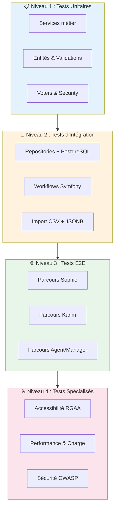
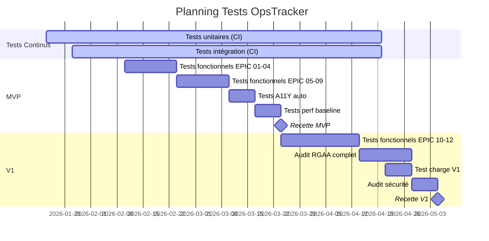

# P5.1 - Plan de Test & Qualification

━━━━━━━━━━━━━━━━━━━━━━━━━━━━━━━━━━━━━━━━━━━━━━━
🧪 **PLAN DE TEST OPSTRACKER** Version : 1.0 Date : 24 janvier 2026 Niveau de confiance : **95%**
━━━━━━━━━━━━━━━━━━━━━━━━━━━━━━━━━━━━━━━━━━━━━━━

---

## 1. Vue d'Ensemble

### 1.1 Périmètre de Test

|Élément|Quantité|Source|
|---|---|---|
|**User Stories**|85|P4.1|
|**EPICs**|12|P4.1|
|**Règles Métier**|~55|P4.1 §3|
|**Personas**|7|P1.3|
|**NFR (Exigences non-fonctionnelles)**|15+|P4.2|

### 1.2 Objectifs de Qualification

|Objectif|Cible|Mesure|
|---|---|---|
|Couverture fonctionnelle|100% US MVP + V1|Scénarios BDD passants|
|Couverture code|≥80%|PHPUnit + Coverage|
|Accessibilité RGAA 4.1|100% critères A+AA|Audit Ara + tests manuels|
|Performance dashboard|<500ms (100k ops)|k6 load tests|
|Sécurité|0 critique OWASP|Audit sécurité|

### 1.3 Stratégie de Test



---

## 2. Environnements de Test

### 2.1 Stack Technique

|Composant|Version|Usage Test|
|---|---|---|
|**PHP**|8.3|PHPUnit 11|
|**Symfony**|7.4 LTS|WebTestCase|
|**PostgreSQL**|17|Fixtures Faker|
|**Redis**|7.x|Mock ou instance test|
|**Node.js**|22 LTS|Playwright|

### 2.2 Environnements

|Env|Base de données|Données|Usage|
|---|---|---|---|
|**test**|SQLite in-memory|Fixtures légères|CI/CD, unitaires|
|**dev**|PostgreSQL local|Faker (3 campagnes, 150 ops)|Dev, intégration|
|**staging**|PostgreSQL CPAM|Données anonymisées|UAT, performance|
|**prod**|PostgreSQL CPAM|Réelles|Post-déploiement smoke|

### 2.3 Jeux de Données de Test

```yaml
# fixtures/test_data.yaml
campagnes:
  - nom: "Migration DRSM → CPAM 92"
    statut: en_cours
    operations: 150
    segments: ["Site Nanterre", "Site Colombes", "Site Asnières"]
    
  - nom: "Déploiement Windows 11"
    statut: planifiee
    operations: 500
    segments: ["Étage 1", "Étage 2", "Étage 3"]
    
  - nom: "Renouvellement Postes 2024"
    statut: terminee
    operations: 1200
    segments: ["Direction", "Production", "Support"]

utilisateurs:
  - email: sophie@cpam92.fr
    role: ROLE_GESTIONNAIRE
    
  - email: karim@cpam92.fr
    role: ROLE_TECHNICIEN
    
  - email: marc@cpam92.fr
    role: ROLE_ADMIN
    
  - email: agent1@cpam92.fr
    role: ROLE_AGENT
    
  - email: manager1@cpam92.fr
    role: ROLE_MANAGER
```

---

## 3. Tests Fonctionnels par EPIC

### 3.1 EPIC-01 : Authentification & Gestion Utilisateurs

**Personas concernés** : Marc (Admin), Sophie, Karim, tous

#### TC-101 : Connexion Utilisateur

|ID|Scénario|Préconditions|Actions|Résultat Attendu|RG|
|---|---|---|---|---|---|
|TC-101-01|Connexion nominale Sophie|Compte Sophie actif|1. Accéder /login<br>2. Saisir email/mdp valides<br>3. Cliquer "Connexion"|Redirection vers Dashboard|RG-001|
|TC-101-02|Connexion nominale Karim|Compte Karim actif|1. Accéder /login<br>2. Saisir email/mdp valides<br>3. Cliquer "Connexion"|Redirection vers "Mes interventions"|RG-001|
|TC-101-03|Identifiants invalides|-|Saisir email/mdp incorrects|Message "Identifiants incorrects" en rouge|RG-001|
|TC-101-04|Verrouillage après 5 échecs|Compteur à 4|Échouer une 5ème tentative|Message "Compte verrouillé 15 min"|RG-006|
|TC-101-05|Déverrouillage automatique|Compte verrouillé depuis 15 min|Tenter connexion valide|Connexion réussie|RG-006|
|TC-101-06|Session Remember Me|Connexion avec remember me|Fermer/rouvrir navigateur|Session conservée|-|
|TC-101-07|Compte désactivé|Compte Sophie désactivé|Tenter connexion|Message "Compte désactivé"|RG-005|

#### TC-102 : Déconnexion

|ID|Scénario|Préconditions|Actions|Résultat Attendu|
|---|---|---|---|---|
|TC-102-01|Déconnexion nominale|Utilisateur connecté|Cliquer [Sophie ▼] → "Déconnexion"|Redirection /login, session invalidée|

#### TC-103 : Création Utilisateur (Admin)

|ID|Scénario|Préconditions|Actions|Résultat Attendu|RG|
|---|---|---|---|---|---|
|TC-103-01|Création nominale|Admin connecté|1. Cliquer "+ Nouvel utilisateur"<br>2. Remplir formulaire<br>3. Valider|Compte créé, email envoyé|RG-002, RG-003|
|TC-103-02|Email existant|Email déjà utilisé|Soumettre avec email existant|Erreur "Email déjà utilisé"|RG-002|
|TC-103-03|Rôle Admin|Admin crée compte|Sélectionner rôle Admin|Permissions Admin attribuées|RG-003|
|TC-103-04|Rôle Gestionnaire|Admin crée compte|Sélectionner rôle Gestionnaire|Permissions Gestionnaire|RG-003|
|TC-103-05|Rôle Technicien|Admin crée compte|Sélectionner rôle Technicien|Permissions Technicien|RG-003|

#### TC-104 : Modification Utilisateur

|ID|Scénario|Préconditions|Actions|Résultat Attendu|RG|
|---|---|---|---|---|---|
|TC-104-01|Modification nominale|Admin connecté|Modifier nom/email utilisateur|Toast "Utilisateur mis à jour"|RG-004|
|TC-104-02|Auto-rétrogradation bloquée|Admin édite son compte|Changer son rôle vers Technicien|Erreur "Impossible de rétrograder votre compte"|RG-004|

#### TC-105 : Désactivation/Réactivation

|ID|Scénario|Préconditions|Actions|Résultat Attendu|RG|
|---|---|---|---|---|---|
|TC-105-01|Désactivation|Admin connecté|Décocher "Actif" pour Karim|Karim ne peut plus se connecter|RG-005|
|TC-105-02|Réactivation|Karim désactivé|Cocher "Actif"|Karim peut se reconnecter|RG-005|
|TC-105-03|Historique préservé|Karim désactivé|Consulter historique opérations|Nom Karim toujours visible|RG-005|

#### TC-106 : Statistiques Utilisateur

|ID|Scénario|Préconditions|Actions|Résultat Attendu|
|---|---|---|---|---|
|TC-106-01|Affichage stats|Admin connecté|Ouvrir détail utilisateur Karim|Voir interventions assignées/réalisées, dernière connexion|
|TC-106-02|Alerte inactivité|Utilisateur jamais connecté|Voir liste utilisateurs|Icône ⚠️ à côté de "Jamais"|

#### TC-107 : Changement Mot de Passe

|ID|Scénario|Préconditions|Actions|Résultat Attendu|RG|
|---|---|---|---|---|---|
|TC-107-01|Changement nominal|Sophie connectée|Saisir ancien + nouveau (x2) mdp|Toast "Mot de passe modifié", reste connectée|RG-001|
|TC-107-02|Ancien mdp incorrect|Sophie connectée|Saisir mauvais ancien mdp|Erreur "Ancien mot de passe incorrect"|RG-001|
|TC-107-03|Confirmation non identique|Sophie connectée|Saisir nouveaux mdp différents|Erreur "Les mots de passe ne correspondent pas"|RG-001|

---

### 3.2 EPIC-02 : Création & Gestion des Campagnes

**Personas concernés** : Sophie (Gestionnaire)

#### TC-201 : Liste des Campagnes

|ID|Scénario|Préconditions|Actions|Résultat Attendu|RG|
|---|---|---|---|---|---|
|TC-201-01|Affichage groupé par statut|3 campagnes différents statuts|Accéder /campagnes|Campagnes groupées : Planifiée, En cours, Terminée|RG-010|
|TC-201-02|Informations affichées|Campagne existante|Voir liste|Nom, dates, progression, propriétaire visibles|-|
|TC-201-03|Tri par date|Plusieurs campagnes|Cliquer sur colonne Date|Tri croissant/décroissant|-|

#### TC-202 : Création Campagne - Étape 1/4 (Infos générales)

|ID|Scénario|Préconditions|Actions|Résultat Attendu|RG|
|---|---|---|---|---|---|
|TC-202-01|Création nominale|Sophie connectée|Remplir nom, type, dates, description|Passage à l'étape 2|RG-011|
|TC-202-02|Nom obligatoire|Formulaire vide|Soumettre sans nom|Erreur "Nom obligatoire"|RG-011|
|TC-202-03|Date fin > date début|Dates inversées|Soumettre|Erreur "Date fin doit être après date début"|RG-011|

#### TC-203 : Création Campagne - Étape 2/4 (Upload CSV)

|ID|Scénario|Préconditions|Actions|Résultat Attendu|RG|
|---|---|---|---|---|---|
|TC-203-01|Import CSV nominal|CSV valide 100 lignes|Upload fichier|Prévisualisation 10 premières lignes|RG-012|
|TC-203-02|Détection séparateur auto|CSV point-virgule|Upload|Séparateur détecté automatiquement|RG-012|
|TC-203-03|Détection encodage|CSV ISO-8859-1|Upload|Encodage converti en UTF-8|RG-012|
|TC-203-04|CSV > 100k lignes|CSV 150k lignes|Upload|Erreur "Fichier trop volumineux (max 100 000)"|RG-012|
|TC-203-05|Format invalide|Fichier .xlsx|Upload|Erreur "Format non supporté (CSV requis)"|RG-012|

#### TC-204 : Création Campagne - Étape 3/4 (Mapping colonnes)

|ID|Scénario|Préconditions|Actions|Résultat Attendu|RG|
|---|---|---|---|---|---|
|TC-204-01|Mapping nominal|CSV prévisualisé|Mapper colonnes CSV → champs OpsTracker|Validation réussie|RG-014|
|TC-204-02|Matricule obligatoire|Mapping incomplet|Ne pas mapper le matricule|Erreur "Colonne matricule obligatoire"|RG-014|
|TC-204-03|Champ custom JSONB|Colonne non standard|Mapper vers champ personnalisé|Stocké en JSONB|RG-015|
|TC-204-04|Ligne en erreur|CSV avec ligne invalide|Valider import|Ligne skippée, log erreur, autres importées|RG-092|

#### TC-205 : Création Campagne - Étape 4/4 (Workflow & Template)

|ID|Scénario|Préconditions|Actions|Résultat Attendu|RG|
|---|---|---|---|---|---|
|TC-205-01|Association template|Templates existants|Sélectionner template checklist|Template associé à la campagne|RG-014|
|TC-205-02|Workflow par défaut|Aucun workflow custom|Valider|Workflow 6 statuts appliqué|RG-017|
|TC-205-03|Création complète|Toutes étapes validées|Cliquer "Créer"|Campagne créée, statut "Planifiée"|RG-010|

#### TC-206 : Ajout Opération Manuelle

|ID|Scénario|Préconditions|Actions|Résultat Attendu|RG|
|---|---|---|---|---|---|
|TC-206-01|Ajout nominal|Campagne existante|Cliquer "+ Opération", remplir formulaire|Opération ajoutée, statut "À planifier"|RG-014, RG-015|
|TC-206-02|Matricule unique|Matricule existant|Soumettre même matricule|Erreur "Matricule déjà existant"|RG-014|

#### TC-207 : Archiver/Désarchiver Campagne

|ID|Scénario|Préconditions|Actions|Résultat Attendu|RG|
|---|---|---|---|---|---|
|TC-207-01|Archivage|Campagne terminée|Cliquer "Archiver"|Campagne masquée de la liste par défaut|RG-016|
|TC-207-02|Désarchivage|Campagne archivée|Afficher archivées, cliquer "Désarchiver"|Campagne réapparaît|RG-016|
|TC-207-03|Filtre archives|Campagnes mixtes|Cocher "Afficher archivées"|Campagnes archivées visibles|RG-016|

#### TC-209 : Mode Inscription

|ID|Scénario|Préconditions|Actions|Résultat Attendu|RG|
|---|---|---|---|---|---|
|TC-209-01|Mode Agent|Création campagne|Sélectionner "Mode Agent"|Agents peuvent s'auto-positionner|RG-110|
|TC-209-02|Mode Manager|Création campagne|Sélectionner "Mode Manager"|Seuls managers positionnent|RG-110|
|TC-209-03|Mode Mixte|Création campagne|Sélectionner "Mode Mixte"|Selon habilitations individuelles|RG-110|

#### TC-210 : Propriétaire Campagne

|ID|Scénario|Préconditions|Actions|Résultat Attendu|RG|
|---|---|---|---|---|---|
|TC-210-01|Propriétaire par défaut|Sophie crée campagne|Créer campagne|Sophie = propriétaire|RG-111|
|TC-210-02|Transfert propriété|Sophie propriétaire|Transférer à Marc|Marc devient propriétaire|RG-111|

#### TC-211 : Visibilité Campagne

|ID|Scénario|Préconditions|Actions|Résultat Attendu|RG|
|---|---|---|---|---|---|
|TC-211-01|Visibilité restreinte défaut|Nouvelle campagne|Créer campagne|Visible uniquement propriétaire + habilités|RG-112|
|TC-211-02|Ajout habilitation|Campagne créée|Ajouter Marc aux habilités|Marc peut voir la campagne|RG-112|

#### TC-212 : Population Cible

|ID|Scénario|Préconditions|Actions|Résultat Attendu|RG|
|---|---|---|---|---|---|
|TC-212-01|Import liste agents|CSV avec emails|Importer population cible|Seuls ces agents peuvent se positionner|RG-113|

---

### 3.3 EPIC-03 : Gestion des Opérations

**Personas concernés** : Sophie (Gestionnaire)

#### TC-301 : Liste des Opérations (Vue Tableau)

|ID|Scénario|Préconditions|Actions|Résultat Attendu|RG|
|---|---|---|---|---|---|
|TC-301-01|Affichage tableau|Campagne avec 150 ops|Accéder aux opérations|Tableau paginé, 50 lignes/page|RG-080|
|TC-301-02|Colonnes affichées|-|Voir tableau|Matricule, Nom, Segment, Statut, Technicien, Actions|-|
|TC-301-03|Performance 100k|100k opérations|Charger page|Affichage <500ms|NFR-PERF|

#### TC-302 : Vue Cards (V1)

|ID|Scénario|Préconditions|Actions|Résultat Attendu|
|---|---|---|---|---|
|TC-302-01|Basculement vue|Vue tableau active|Cliquer icône "Cards"|Affichage en cartes|
|TC-302-02|Infos sur card|-|Voir une card|Matricule, nom, statut, couleur segment|

#### TC-303 : Filtrer les Opérations

|ID|Scénario|Préconditions|Actions|Résultat Attendu|
|---|---|---|---|---|
|TC-303-01|Filtre par statut|Ops tous statuts|Sélectionner "En cours"|Seules ops "En cours" visibles|
|TC-303-02|Filtre par segment|Ops multi-segments|Sélectionner "Site Nanterre"|Seules ops Nanterre visibles|
|TC-303-03|Filtre par technicien|Ops assignées|Sélectionner "Karim"|Seules ops de Karim visibles|
|TC-303-04|Filtres combinés|-|Statut + Segment|Intersection des filtres|
|TC-303-05|Reset filtres|Filtres actifs|Cliquer "Réinitialiser"|Tous les filtres effacés|

#### TC-304 : Modifier Statut Inline

|ID|Scénario|Préconditions|Actions|Résultat Attendu|RG|
|---|---|---|---|---|---|
|TC-304-01|Changement nominal|Op "À planifier"|Cliquer dropdown → "Planifiée"|Statut mis à jour, timestamp enregistré|RG-017|
|TC-304-02|Transition invalide|Op "Terminée"|Tenter "À planifier"|Erreur "Transition non autorisée"|RG-017|
|TC-304-03|Temps réel|Sophie + Karim connectés|Karim change statut|Dashboard Sophie mis à jour <30s|RG-080|

#### TC-305 : Trier les Colonnes (V1)

|ID|Scénario|Préconditions|Actions|Résultat Attendu|
|---|---|---|---|---|
|TC-305-01|Tri matricule|Liste affichée|Cliquer entête "Matricule"|Tri A-Z puis Z-A|
|TC-305-02|Tri date|Liste affichée|Cliquer entête "Date MAJ"|Tri chronologique|

#### TC-306 : Assigner Technicien

|ID|Scénario|Préconditions|Actions|Résultat Attendu|RG|
|---|---|---|---|---|---|
|TC-306-01|Assignation nominale|Op non assignée|Sélectionner Karim dans dropdown|Karim assigné, voit l'op dans "Mes interventions"|RG-018|
|TC-306-02|Réassignation|Op assignée à Karim|Changer pour Thomas|Thomas assigné, Karim ne voit plus l'op|RG-018|

#### TC-307 : Exporter CSV

|ID|Scénario|Préconditions|Actions|Résultat Attendu|
|---|---|---|---|---|
|TC-307-01|Export complet|150 opérations|Cliquer "Exporter CSV"|Téléchargement CSV 150 lignes|
|TC-307-02|Export filtré|Filtre "En cours" actif|Exporter|CSV avec uniquement ops filtrées|

#### TC-308 : Recherche Globale

|ID|Scénario|Préconditions|Actions|Résultat Attendu|
|---|---|---|---|---|
|TC-308-01|Recherche matricule|Op matricule "PC-2024-0042"|Saisir "PC-2024-0042"|Opération trouvée|
|TC-308-02|Recherche nom|Op nom "DUPONT"|Saisir "DUPONT"|Opérations correspondantes|
|TC-308-03|Recherche multi-campagnes|-|Rechercher globalement|Résultats de toutes campagnes|

#### TC-309 : Supprimer Opération (V1)

|ID|Scénario|Préconditions|Actions|Résultat Attendu|
|---|---|---|---|---|
|TC-309-01|Suppression avec confirmation|Op existante|Cliquer supprimer → Confirmer|Op supprimée|
|TC-309-02|Annulation suppression|-|Cliquer supprimer → Annuler|Op conservée|

---

### 3.4 EPIC-04 : Interface Terrain (Karim)

**Personas concernés** : Karim (Technicien)

> ⚠️ **TESTS CRITIQUES UX** — Ces tests valident l'objectif "zéro formation, <5min d'apprentissage"

#### TC-401 : Mes Interventions

|ID|Scénario|Préconditions|Actions|Résultat Attendu|RG|
|---|---|---|---|---|---|
|TC-401-01|Affichage filtrée|Karim connecté, 5 ops assignées|Accéder "Mes interventions"|Liste des 5 ops de Karim uniquement|RG-020|
|TC-401-02|Tri par date intervention|Ops multi-dates|Voir liste|Triées par date d'intervention croissante|-|
|TC-401-03|Mobile responsive|Écran 375px largeur|Accéder|Interface lisible, boutons 56px min|RG-082|
|TC-401-04|Temps chargement|10 interventions|Charger page|Affichage <1s|NFR-PERF|

#### TC-402 : Détail Intervention

|ID|Scénario|Préconditions|Actions|Résultat Attendu|
|---|---|---|---|---|
|TC-402-01|Ouverture détail|Liste affichée|Cliquer sur une intervention|Détail avec infos complètes|
|TC-402-02|Infos affichées|-|Voir détail|Matricule, nom, segment, statut, checklist, docs|
|TC-402-03|Accessibilité|-|Navigation clavier|Tab navigable, focus visible|

#### TC-403 : Changement Statut 1 Clic

|ID|Scénario|Préconditions|Actions|Résultat Attendu|RG|
|---|---|---|---|---|---|
|TC-403-01|Bouton "Démarrer"|Op "Planifiée"|Cliquer bouton vert "Démarrer"|Statut → "En cours", timestamp|RG-017, RG-021|
|TC-403-02|Bouton "Terminer"|Op "En cours"|Cliquer bouton bleu "Terminer"|Statut → "Terminée"|RG-017, RG-021|
|TC-403-03|Bouton "À remédier"|Op "En cours"|Cliquer bouton orange "À remédier"|Statut → "À remédier", motif optionnel|RG-017, RG-021|
|TC-403-04|Taille boutons|Mobile|Mesurer boutons|Minimum 56x56 pixels|RG-082|
|TC-403-05|Feedback visuel|Clic sur bouton|Observer|Toast confirmation, couleur changée|-|

#### TC-404 : Retour Automatique

|ID|Scénario|Préconditions|Actions|Résultat Attendu|
|---|---|---|---|---|
|TC-404-01|Retour après action|Détail intervention|Changer statut|Retour liste "Mes interventions"|
|TC-404-02|Position conservée|Liste scrollée|Action + retour|Position de scroll conservée|

---

### 3.5 EPIC-05 : Checklists

**Personas concernés** : Sophie (Template), Karim (Exécution)

#### TC-501 : Cocher Étape Checklist

|ID|Scénario|Préconditions|Actions|Résultat Attendu|RG|
|---|---|---|---|---|---|
|TC-501-01|Coche nominale|Checklist affichée|Cocher étape 1|Étape marquée ✓, timestamp enregistré|-|
|TC-501-02|Décoche|Étape cochée|Décocher|Étape non cochée, timestamp supprimé|-|
|TC-501-03|Zone tactile|Mobile|Toucher checkbox|Zone minimum 48x48px|RG-082|
|TC-501-04|Mise à jour sans reload|Étape cochée|Cocher|Turbo Frame update, pas de rechargement|-|

#### TC-502 : Progression Checklist

|ID|Scénario|Préconditions|Actions|Résultat Attendu|
|---|---|---|---|---|
|TC-502-01|Calcul progression|5/10 étapes cochées|Voir progression|Barre 50%, texte "5/10"|
|TC-502-02|Progression par phase|3 phases|Voir|Progression globale + par phase|

#### TC-503 : Créer Template Checklist (Sophie)

|ID|Scénario|Préconditions|Actions|Résultat Attendu|RG|
|---|---|---|---|---|---|
|TC-503-01|Création nominale|Sophie connectée|1. Cliquer "Nouveau template"<br>2. Nommer<br>3. Ajouter étapes<br>4. Sauver|Template v1.0 créé|RG-030|
|TC-503-02|Étape avec doc lié|Template en édition|Lier doc à une étape|Lien actif dans checklist|RG-030|
|TC-503-03|Ordre étapes|5 étapes|Glisser-déposer étape 3 → position 1|Nouvel ordre sauvé|-|

#### TC-504 : Versioning Template (V1)

|ID|Scénario|Préconditions|Actions|Résultat Attendu|RG|
|---|---|---|---|---|---|
|TC-504-01|Nouvelle version|Template v1.0 existant|Modifier et sauver|Template v1.1 créé|RG-031|
|TC-504-02|Snapshot préservé|Instance en cours sur v1.0|Créer v1.1|Instance garde snapshot v1.0|RG-031|

#### TC-505 : Phases Template (V1)

|ID|Scénario|Préconditions|Actions|Résultat Attendu|RG|
|---|---|---|---|---|---|
|TC-505-01|Création phases|Template en édition|Créer "Préparation", "Exécution", "Validation"|3 phases avec étapes respectives|RG-032|

#### TC-506 : Consulter Document depuis Checklist (V1)

|ID|Scénario|Préconditions|Actions|Résultat Attendu|
|---|---|---|---|---|
|TC-506-01|Ouverture PDF|Doc PDF lié à étape|Cliquer icône doc|PDF ouvert dans nouvel onglet|

#### TC-507 : Télécharger Script depuis Checklist (V1)

|ID|Scénario|Préconditions|Actions|Résultat Attendu|
|---|---|---|---|---|
|TC-507-01|Téléchargement|Script .ps1 lié|Cliquer "Télécharger"|Fichier téléchargé|

---

### 3.6 EPIC-06 : Dashboard & Reporting

**Personas concernés** : Sophie (Gestionnaire), Direction

#### TC-601 : Dashboard Temps Réel

|ID|Scénario|Préconditions|Actions|Résultat Attendu|RG|
|---|---|---|---|---|---|
|TC-601-01|Affichage KPIs|Campagne 150 ops|Accéder dashboard|Compteurs par statut, barre progression|RG-040|
|TC-601-02|Mise à jour temps réel|Sophie sur dashboard|Karim change statut op|Dashboard mis à jour <30s|RG-040, RG-081|
|TC-601-03|Performance|100k opérations|Charger dashboard|Affichage <500ms|NFR-PERF|

#### TC-602 : Progression par Segment

|ID|Scénario|Préconditions|Actions|Résultat Attendu|
|---|---|---|---|---|
|TC-602-01|Vue par segment|3 segments|Voir section "Par segment"|3 barres de progression distinctes|
|TC-602-02|Détail segment|Segment "Site Nanterre"|Cliquer|Liste filtrée par segment|

#### TC-603 : Graphique Vélocité (V2)

|ID|Scénario|Préconditions|Actions|Résultat Attendu|
|---|---|---|---|---|
|TC-603-01|Courbe vélocité|Campagne 7+ jours|Voir graphique|Courbe ops terminées/jour|

#### TC-604 : Export Dashboard PDF (V1)

|ID|Scénario|Préconditions|Actions|Résultat Attendu|
|---|---|---|---|---|
|TC-604-01|Export nominal|Dashboard affiché|Cliquer "Exporter PDF"|PDF téléchargé avec KPIs + graphiques|

#### TC-605 : Partage URL Lecture Seule (V1)

|ID|Scénario|Préconditions|Actions|Résultat Attendu|RG|
|---|---|---|---|---|---|
|TC-605-01|Génération lien|Dashboard campagne|Cliquer "Partager"|URL unique générée|RG-041|
|TC-605-02|Accès anonyme|URL partagée|Accéder via lien (non connecté)|Dashboard visible en lecture seule|RG-041|

#### TC-607 : Dashboard Multi-Campagnes

|ID|Scénario|Préconditions|Actions|Résultat Attendu|
|---|---|---|---|---|
|TC-607-01|Vue globale|3 campagnes actives|Accéder dashboard global|Vue agrégée des 3 campagnes|
|TC-607-02|Drill-down|Vue globale|Cliquer sur campagne|Détail de la campagne|

#### TC-608 : Filtre Dashboard Global (V1)

|ID|Scénario|Préconditions|Actions|Résultat Attendu|
|---|---|---|---|---|
|TC-608-01|Filtre par statut|Vue globale|Filtrer "En cours"|Seules campagnes "En cours"|

---

### 3.7 EPIC-07 : Base Documentaire

**Personas concernés** : Sophie (Gestionnaire)

#### TC-701 : Liste Documents

|ID|Scénario|Préconditions|Actions|Résultat Attendu|
|---|---|---|---|---|
|TC-701-01|Affichage|10 docs|Accéder "Documents"|Liste paginée avec nom, type, taille, date|

#### TC-702 : Upload Document

|ID|Scénario|Préconditions|Actions|Résultat Attendu|RG|
|---|---|---|---|---|---|
|TC-702-01|Upload PDF|Fichier PDF 5Mo|Drag & drop ou clic|Upload réussi, aperçu visible|RG-050|
|TC-702-02|Upload > 50Mo|Fichier 60Mo|Tenter upload|Erreur "Fichier trop volumineux (max 50Mo)"|RG-050|
|TC-702-03|Upload .exe|Fichier script.exe|Upload|Upload réussi (autorisé interne)|RG-050|
|TC-702-04|Formats supportés|.pdf, .docx, .xlsx, .png, .ps1|Uploader chaque|Tous acceptés|RG-050|

#### TC-703 : Lier Document à Campagne (V1)

|ID|Scénario|Préconditions|Actions|Résultat Attendu|RG|
|---|---|---|---|---|---|
|TC-703-01|Liaison nominale|Doc existant|Associer à campagne "Migration DRSM"|Doc visible dans contexte campagne|RG-051|

#### TC-704 : Supprimer Document (V1)

|ID|Scénario|Préconditions|Actions|Résultat Attendu|
|---|---|---|---|---|
|TC-704-01|Suppression|Doc non lié|Supprimer|Doc supprimé|
|TC-704-02|Suppression doc lié|Doc lié à campagne|Supprimer|Warning "Document utilisé", confirmation requise|

---

### 3.8 EPIC-08 : Configuration & Administration

**Personas concernés** : Sophie (Admin config), Marc (Admin système)

#### TC-801 : Types d'Opération

|ID|Scénario|Préconditions|Actions|Résultat Attendu|RG|
|---|---|---|---|---|---|
|TC-801-01|Création type|Admin connecté|Créer type "Migration PC" avec icône + couleur|Type disponible dans dropdown campagne|RG-060|

#### TC-802 : Champs Personnalisés (V1)

|ID|Scénario|Préconditions|Actions|Résultat Attendu|RG|
|---|---|---|---|---|---|
|TC-802-01|Ajout champ texte|Type existant|Ajouter champ "Référence SAP" (texte)|Champ disponible lors import/saisie|RG-061, RG-015|
|TC-802-02|Champ date|Type existant|Ajouter champ "Date garantie" (date)|Champ avec datepicker|RG-061|
|TC-802-03|Champ liste|Type existant|Ajouter champ "Modèle" (choix: Dell, HP, Lenovo)|Dropdown dans formulaire|RG-061|

#### TC-804 : Historique Modifications (V1)

|ID|Scénario|Préconditions|Actions|Résultat Attendu|RG|
|---|---|---|---|---|---|
|TC-804-01|Audit trail|Opération modifiée|Voir historique|Liste : date, utilisateur, champ, ancienne/nouvelle valeur|RG-070|
|TC-804-02|Filtre par utilisateur|Historique long|Filtrer par "Sophie"|Seules modifs de Sophie||

#### TC-806 : Export/Import Configuration (V1)

|ID|Scénario|Préconditions|Actions|Résultat Attendu|RG|
|---|---|---|---|---|---|
|TC-806-01|Export config|Config personnalisée|Exporter JSON|Fichier avec types, champs, templates|RG-100|
|TC-806-02|Import config|Fichier JSON export|Importer sur nouvelle instance|Configuration restaurée|RG-100|

#### TC-807 : Profil Coordinateur (V1)

|ID|Scénario|Préconditions|Actions|Résultat Attendu|RG|
|---|---|---|---|---|---|
|TC-807-01|Création coordinateur|Admin connecté|Créer utilisateur avec rôle Coordinateur|Peut positionner agents sans lien hiérarchique|RG-114|

#### TC-808 : Habilitations par Campagne (V1)

|ID|Scénario|Préconditions|Actions|Résultat Attendu|RG|
|---|---|---|---|---|---|
|TC-808-01|Habilitation lecture|Campagne créée|Ajouter Direction en lecture seule|Direction voit mais ne modifie pas|RG-115|
|TC-808-02|Habilitation complète|Campagne créée|Ajouter Sophie en édition|Sophie peut modifier|RG-115|

---

### 3.9 EPIC-09 : Prérequis & Segments

**Personas concernés** : Sophie (Gestionnaire)

#### TC-901 : Prérequis Globaux (V1)

|ID|Scénario|Préconditions|Actions|Résultat Attendu|RG|
|---|---|---|---|---|---|
|TC-901-01|Affichage prérequis|Campagne avec prérequis|Voir onglet "Prérequis"|Liste avec statut (✓/✗)|RG-090|
|TC-901-02|Indicateur déclaratif|Prérequis non validé|Observer|Pas de blocage opérations|RG-090|

#### TC-902 : Modifier Prérequis Global (V1)

|ID|Scénario|Préconditions|Actions|Résultat Attendu|RG|
|---|---|---|---|---|---|
|TC-902-01|Ajout prérequis|Campagne existante|Ajouter "Commande matériel livrée"|Prérequis visible avec statut initial "❌"|RG-090|
|TC-902-02|Validation prérequis|Prérequis existant|Cocher "Validé"|Statut → "✓"|RG-090|

#### TC-903/904 : Prérequis par Segment (V1)

|ID|Scénario|Préconditions|Actions|Résultat Attendu|RG|
|---|---|---|---|---|---|
|TC-903-01|Prérequis segment|Segment "Site Nanterre"|Ajouter "Salle serveur prête"|Prérequis spécifique au segment|RG-091|

#### TC-905 : Créer/Modifier Segments

|ID|Scénario|Préconditions|Actions|Résultat Attendu|
|---|---|---|---|---|
|TC-905-01|Création segment|Campagne existante|Ajouter segment "Étage 4"|Segment créé avec couleur|
|TC-905-02|Modification couleur|Segment existant|Changer couleur|Couleur mise à jour partout|

#### TC-906 : Progression par Segment

|ID|Scénario|Préconditions|Actions|Résultat Attendu|
|---|---|---|---|---|
|TC-906-01|Détail segment|Segment avec 50 ops|Cliquer sur segment|Progression détaillée + liste ops|

---

### 3.10 EPIC-10 : Interface Réservation (End-Users)

**Personas concernés** : Agent Impacté, Manager Métier, Coordinateur

> ⚠️ **TESTS CRITIQUES UX** — Parcours "type Doctolib", 3 clics max

#### TC-1001 : Voir Créneaux Disponibles (Agent)

|ID|Scénario|Préconditions|Actions|Résultat Attendu|RG|
|---|---|---|---|---|---|
|TC-1001-01|Affichage créneaux|Agent dans population cible|Accéder interface réservation|Calendrier avec créneaux disponibles|RG-120|
|TC-1001-02|Filtrage segment|Agent segment "Site Nanterre"|Voir créneaux|Seuls créneaux de Nanterre|RG-120|
|TC-1001-03|Créneaux pleins masqués|Créneau capacité atteinte|Voir calendrier|Créneau non sélectionnable (grisé)|-|

#### TC-1002 : Se Positionner sur Créneau (Agent)

|ID|Scénario|Préconditions|Actions|Résultat Attendu|RG|
|---|---|---|---|---|---|
|TC-1002-01|Réservation nominale|Agent authentifié|1. Sélectionner créneau<br>2. Confirmer|Créneau réservé, email + ICS envoyés|RG-121, RG-122|
|TC-1002-02|Unicité réservation|Agent déjà positionné|Tenter 2ème créneau|Erreur "Vous avez déjà un créneau"|RG-121|
|TC-1002-03|Parcours 3 clics|Agent sur interface|Compter clics jusqu'à confirmation|Maximum 3 clics|NFR-UX|

#### TC-1003 : Annuler/Modifier Créneau (Agent)

|ID|Scénario|Préconditions|Actions|Résultat Attendu|RG|
|---|---|---|---|---|---|
|TC-1003-01|Annulation|Créneau réservé J-5|Annuler|Créneau libéré, email confirmation|RG-123|
|TC-1003-02|Modification|Créneau réservé J-5|Modifier → autre créneau|Nouveau créneau, nouvel ICS|RG-123|
|TC-1003-03|Verrouillage J-2|Créneau réservé J-1|Tenter annuler|Erreur "Modification impossible (verrouillage J-2)"|RG-123|

#### TC-1004 : Récapitulatif Agent (V1)

|ID|Scénario|Préconditions|Actions|Résultat Attendu|
|---|---|---|---|---|
|TC-1004-01|Affichage récap|Agent avec créneau|Accéder "Mon intervention"|Date, heure, lieu, instructions|

#### TC-1005 : Vue Équipe (Manager)

|ID|Scénario|Préconditions|Actions|Résultat Attendu|RG|
|---|---|---|---|---|---|
|TC-1005-01|Liste agents|Manager connecté|Accéder "Mon équipe"|Tableau agents avec statut (positionné/non)|RG-124|
|TC-1005-02|Périmètre limité|Manager service A|Voir équipe|Seuls agents service A|RG-124|

#### TC-1006 : Positionner Agent (Manager)

|ID|Scénario|Préconditions|Actions|Résultat Attendu|RG|
|---|---|---|---|---|---|
|TC-1006-01|Positionnement|Manager sur vue équipe|Sélectionner agent + créneau|Agent positionné, notification envoyée|RG-125, RG-126|
|TC-1006-02|Traçabilité|Positionnement effectué|Voir audit|"Positionné par [Manager]" enregistré|RG-125|

#### TC-1007 : Modifier/Annuler pour Agent (Manager)

|ID|Scénario|Préconditions|Actions|Résultat Attendu|RG|
|---|---|---|---|---|---|
|TC-1007-01|Modification|Agent positionné|Manager modifie créneau|Nouvel ICS, notification agent|RG-126|

#### TC-1008 : Alerte Concentration Équipe (V1)

|ID|Scénario|Préconditions|Actions|Résultat Attendu|RG|
|---|---|---|---|---|---|
|TC-1008-01|Warning >50%|6/10 agents même jour|Voir dashboard manager|Alerte "Attention: concentration d'absences"|RG-127|

#### TC-1010 : Positionner (Coordinateur) (V1)

|ID|Scénario|Préconditions|Actions|Résultat Attendu|RG|
|---|---|---|---|---|---|
|TC-1010-01|Positionnement transverse|Coordinateur habilité|Positionner agent autre service|Agent positionné, traçabilité|RG-114, RG-125|

#### TC-1011 : Auth Carte Agent (V1)

|ID|Scénario|Préconditions|Actions|Résultat Attendu|RG|
|---|---|---|---|---|---|
|TC-1011-01|Connexion carte|Agent avec carte|Badger|Authentification automatique|RG-128|
|TC-1011-02|Fallback AD|Carte non reconnue|Saisir login/mdp AD|Connexion via AD|RG-128|

---

### 3.11 EPIC-11 : Gestion des Créneaux & Capacité

**Personas concernés** : Sophie (Gestionnaire)

#### TC-1101 : Créer Créneaux

|ID|Scénario|Préconditions|Actions|Résultat Attendu|RG|
|---|---|---|---|---|---|
|TC-1101-01|Création manuelle|Campagne créée|Créer créneau 14h-15h le 15/02|Créneau disponible|RG-130|
|TC-1101-02|Génération auto|Plage horaire définie|Générer créneaux 9h-17h (1h/slot) pour 5 jours|40 créneaux créés|RG-130|

#### TC-1102 : Capacité IT (V1)

|ID|Scénario|Préconditions|Actions|Résultat Attendu|RG|
|---|---|---|---|---|---|
|TC-1102-01|Définir ressources|Configuration campagne|Définir 5 techniciens disponibles|Capacité calculée automatiquement|RG-131|

#### TC-1103 : Durée Intervention (V1)

|ID|Scénario|Préconditions|Actions|Résultat Attendu|RG|
|---|---|---|---|---|---|
|TC-1103-01|Abaque par type|Type "Migration PC"|Définir durée 45 min|Créneaux générés avec cette durée|RG-132|

#### TC-1104 : Modifier Créneau

|ID|Scénario|Préconditions|Actions|Résultat Attendu|RG|
|---|---|---|---|---|---|
|TC-1104-01|Modification horaire|Créneau existant|Changer 14h → 15h|Créneau mis à jour, agents notifiés|RG-133|

#### TC-1105 : Supprimer Créneau

|ID|Scénario|Préconditions|Actions|Résultat Attendu|RG|
|---|---|---|---|---|---|
|TC-1105-01|Suppression vide|Créneau sans réservation|Supprimer|Créneau supprimé|RG-134|
|TC-1105-02|Suppression avec résa|Créneau avec 3 agents|Supprimer|Confirmation requise, agents notifiés|RG-134|

#### TC-1106 : Taux de Remplissage

|ID|Scénario|Préconditions|Actions|Résultat Attendu|
|---|---|---|---|---|
|TC-1106-01|Affichage taux|Créneaux avec réservations|Voir dashboard créneaux|Taux global + par créneau (ex: "15/20 - 75%")|

#### TC-1107 : Verrouillage J-X (V1)

|ID|Scénario|Préconditions|Actions|Résultat Attendu|RG|
|---|---|---|---|---|---|
|TC-1107-01|Config verrouillage|Configuration campagne|Définir verrouillage J-3|Créneaux non modifiables 3 jours avant|RG-123|

#### TC-1108 : Créneaux par Segment (V1)

|ID|Scénario|Préconditions|Actions|Résultat Attendu|RG|
|---|---|---|---|---|---|
|TC-1108-01|Association segment|Créneaux existants|Associer créneaux 14h-16h au segment "Site Nanterre"|Seuls agents Nanterre voient ces créneaux|RG-135|

---

### 3.12 EPIC-12 : Notifications & Agenda

**Personas concernés** : Agent Impacté, Manager Métier

#### TC-1201 : Email Confirmation avec ICS (V1)

|ID|Scénario|Préconditions|Actions|Résultat Attendu|RG|
|---|---|---|---|---|---|
|TC-1201-01|Email envoyé|Agent se positionne|Confirmer réservation|Email reçu avec fichier .ics|RG-140|
|TC-1201-02|Contenu ICS|Email reçu|Ouvrir .ics|Événement avec date, heure, lieu, description|RG-140|
|TC-1201-03|Import Outlook|Fichier .ics|Double-clic|Événement ajouté au calendrier|-|

#### TC-1202 : Email Rappel J-2 (V1)

|ID|Scénario|Préconditions|Actions|Résultat Attendu|RG|
|---|---|---|---|---|---|
|TC-1202-01|Envoi automatique|Agent positionné pour J+2|Attendre J-2 à 9h|Email rappel envoyé|RG-141|

#### TC-1203 : Email Modification (V1)

|ID|Scénario|Préconditions|Actions|Résultat Attendu|RG|
|---|---|---|---|---|---|
|TC-1203-01|Contenu email|Manager modifie créneau agent|Email envoyé|Contient ancien créneau + nouveau + nouvel ICS|RG-142|

#### TC-1204 : Email Annulation (V1)

|ID|Scénario|Préconditions|Actions|Résultat Attendu|RG|
|---|---|---|---|---|---|
|TC-1204-01|Contenu email|Créneau annulé|Email envoyé|Contient lien vers interface repositionnement|RG-143|

#### TC-1205 : Email Invitation Initiale

|ID|Scénario|Préconditions|Actions|Résultat Attendu|RG|
|---|---|---|---|---|---|
|TC-1205-01|Mode Agent|Campagne mode "Agent"|Lancer inscriptions|Email envoyé à tous les agents de la liste|RG-144|
|TC-1205-02|Mode Manager|Campagne mode "Manager"|Lancer inscriptions|Email envoyé aux managers|RG-144|

---

## 4. Tests d'Accessibilité RGAA 4.1

### 4.1 Critères à Valider

|Thématique|Critères|Outil de Test|
|---|---|---|
|**Images**|Alternatives textuelles|axe-core|
|**Cadres**|Titres de frames|Manuel|
|**Couleurs**|Contraste 4.5:1 (texte), 3:1 (grand)|Color Contrast Analyzer|
|**Multimédia**|Sous-titres, audiodescription|N/A (pas de vidéo)|
|**Tableaux**|Entêtes, structure|axe-core|
|**Liens**|Intitulés explicites|axe-core|
|**Scripts**|Alternatives, compatibilité|Manuel + NVDA|
|**Éléments obligatoires**|Langue, titre, validité HTML|axe-core|
|**Structuration**|Titres, listes, landmarks|axe-core|
|**Présentation**|CSS désactivable, espacement|Manuel|
|**Formulaires**|Labels, erreurs, regroupements|axe-core|
|**Navigation**|Skip links, plan du site, fil d'Ariane|Manuel|
|**Consultation**|Délais, contenus en mouvement|Manuel|

### 4.2 Scénarios de Test Accessibilité

|ID|Scénario|Outil|Critère d'Acceptation|RG|
|---|---|---|---|---|
|A11Y-001|Navigation clavier complète|Manuel + NVDA|Tab/Shift+Tab sur tous éléments interactifs|RG-080|
|A11Y-002|Focus visible|Manuel|Indicateur focus min 2px|RG-081|
|A11Y-003|Boutons terrain 56px|Manuel|Taille min 56x56px mesurée|RG-082|
|A11Y-004|Checkboxes 48px|Manuel|Zone tactile 48x48px|RG-082|
|A11Y-005|Contraste texte|CCA|Ratio ≥4.5:1 (normal), ≥3:1 (grand)|RG-083|
|A11Y-006|Contraste boutons|CCA|Ratio ≥3:1 (graphiques UI)|RG-083|
|A11Y-007|Lecteur d'écran|NVDA + Firefox|Parcours Sophie complet vocalisé|RG-084|
|A11Y-008|Lecteur d'écran mobile|VoiceOver iOS|Parcours Karim vocalisé|RG-084|
|A11Y-009|Zoom 200%|Firefox|Interface utilisable sans scroll horizontal|RG-085|
|A11Y-010|Mode sombre|Manuel|Design tokens alternés, contraste maintenu|-|

### 4.3 Audit Automatisé

```bash
# Script d'audit axe-core
npx playwright test --grep @a11y

# Rapport Ara (si disponible)
ara audit --url http://localhost/dashboard --output report.html
```

---

## 5. Tests de Performance

### 5.1 Objectifs de Performance (NFR-PERF)

|Métrique|Cible|Condition|
|---|---|---|
|**Dashboard <500ms**|P95 < 500ms|100k opérations, 50 users simultanés|
|**Import CSV**|<30s|10k lignes sync, >10k async|
|**Recherche**|<200ms|Index GIN sur JSONB|
|**Page liste**|<300ms|Pagination 50 lignes|

### 5.2 Scénarios de Charge (k6)

```javascript
// k6/scenarios/dashboard_load.js
import http from 'k6/http';
import { check, sleep } from 'k6';

export const options = {
  stages: [
    { duration: '30s', target: 10 },   // Montée à 10 users
    { duration: '1m', target: 50 },    // Montée à 50 users
    { duration: '2m', target: 50 },    // Plateau
    { duration: '30s', target: 0 },    // Descente
  ],
  thresholds: {
    http_req_duration: ['p(95)<500'],  // 95% < 500ms
    http_req_failed: ['rate<0.01'],    // <1% erreurs
  },
};

export default function () {
  // TC-PERF-001: Dashboard avec 100k ops
  const dashRes = http.get('http://localhost/campagne/1/dashboard');
  check(dashRes, {
    'dashboard status 200': (r) => r.status === 200,
    'dashboard < 500ms': (r) => r.timings.duration < 500,
  });
  
  sleep(1);
  
  // TC-PERF-002: Liste opérations paginée
  const listRes = http.get('http://localhost/campagne/1/operations?page=1');
  check(listRes, {
    'list status 200': (r) => r.status === 200,
    'list < 300ms': (r) => r.timings.duration < 300,
  });
  
  sleep(2);
}
```

### 5.3 Cas de Test Performance

|ID|Scénario|Charge|Métriques|Seuil|
|---|---|---|---|---|
|PERF-001|Dashboard 100k ops|50 users|Response time P95|<500ms|
|PERF-002|Import CSV 100k lignes|1 user|Temps total|<5min (async)|
|PERF-003|Recherche JSONB|20 users|Response time P95|<200ms|
|PERF-004|Turbo Stream updates|100 ops/min|Latence|<1s|
|PERF-005|Export CSV 10k|5 users|Temps génération|<30s|

---

## 6. Tests de Sécurité

### 6.1 Checklist OWASP Top 10

|#|Vulnérabilité|Test|Critère|
|---|---|---|---|
|A01|Broken Access Control|Tenter accès ressources non autorisées|403 systématique|
|A02|Cryptographic Failures|Vérifier HTTPS, hachage mdp|bcrypt, TLS 1.2+|
|A03|Injection|SQL injection sur recherche|Requêtes préparées|
|A04|Insecure Design|Revue architecture|Voters Symfony|
|A05|Security Misconfiguration|Headers, expositions|CSP, X-Frame-Options|
|A06|Vulnerable Components|Audit dépendances|0 CVE critique|
|A07|Auth Failures|Brute force, session fixation|Rate limiting, rotation|
|A08|Software & Data Integrity|CSRF tokens|Token sur tous POST|
|A09|Logging Failures|Audit trail complet|auditor-bundle|
|A10|SSRF|Upload documents|Validation MIME|

### 6.2 Scénarios de Test Sécurité

|ID|Scénario|Actions|Résultat Attendu|
|---|---|---|---|
|SEC-001|Accès non authentifié|GET /dashboard sans session|Redirect /login|
|SEC-002|Accès Karim à admin|Karim tente GET /admin|403 Forbidden|
|SEC-003|CSRF sur modification|POST sans token CSRF|403 Forbidden|
|SEC-004|Injection SQL recherche|Rechercher "'; DROP TABLE --"|0 résultat, pas d'erreur|
|SEC-005|XSS dans commentaire|Insérer `<script>alert(1)</script>`|Échappé à l'affichage|
|SEC-006|Brute force login|10 tentatives rapides|Rate limit après 5|
|SEC-007|Session fixation|Injecter session_id|Nouvelle session après login|
|SEC-008|Upload malveillant|Upload fichier.php.png|Rejeté ou stocké hors webroot|
|SEC-009|IDOR opération|GET /operation/999 (autre campagne)|403 Forbidden|
|SEC-010|Audit modification|Modifier opération|Entrée audit trail|

---

## 7. Matrice de Traçabilité Tests ↔ Requirements

### 7.1 Couverture par EPIC

|EPIC|US|Tests Fonctionnels|Tests A11Y|Tests Perf|Tests Sécu|
|---|---|---|---|---|---|
|EPIC-01|7|TC-101 à TC-107|A11Y-001|-|SEC-001 à SEC-007|
|EPIC-02|12|TC-201 à TC-212|-|PERF-002|SEC-003, SEC-004|
|EPIC-03|9|TC-301 à TC-309|-|PERF-001, PERF-003|SEC-009|
|EPIC-04|4|TC-401 à TC-404|A11Y-003, A11Y-008|-|-|
|EPIC-05|8|TC-501 à TC-507|A11Y-004|-|-|
|EPIC-06|8|TC-601 à TC-608|A11Y-001, A11Y-009|PERF-001, PERF-004|-|
|EPIC-07|5|TC-701 à TC-704|-|-|SEC-008, SEC-010|
|EPIC-08|8|TC-801 à TC-808|-|-|SEC-002|
|EPIC-09|6|TC-901 à TC-906|-|-|-|
|EPIC-10|12|TC-1001 à TC-1011|A11Y-001|-|SEC-001|
|EPIC-11|8|TC-1101 à TC-1108|-|-|-|
|EPIC-12|6|TC-1201 à TC-1205|-|-|-|

### 7.2 Couverture Règles Métier

|RG|Description|Tests Couvrant|
|---|---|---|
|RG-001|Authentification email/mdp|TC-101-_, TC-107-_|
|RG-005|Désactivation utilisateur|TC-105-*|
|RG-006|Verrouillage 5 échecs|TC-101-04, TC-101-05|
|RG-010|Workflow campagne|TC-201-01|
|RG-012|Import CSV 100k|TC-203-*, PERF-002|
|RG-017|Workflow opération|TC-304-_, TC-403-_|
|RG-040|Dashboard temps réel|TC-601-02, PERF-004|
|RG-080|Accessibilité clavier|A11Y-001|
|RG-082|Cibles tactiles 48/56px|A11Y-003, A11Y-004|
|RG-121|Unicité réservation|TC-1002-02|
|RG-122|Email ICS|TC-1201-*|

---

## 8. Critères d'Acceptation Globaux

### 8.1 Critères GO/NO-GO par Phase

|Phase|Critères de Passage|Seuil|
|---|---|---|
|**MVP**|Tests fonctionnels EPIC 01-09|100% passants|
||Couverture code|≥70%|
||Tests A11Y auto|0 erreur axe-core|
||Performance dashboard|<500ms P95|
|**V1**|Tests fonctionnels complets|100% passants|
||Couverture code|≥80%|
||Audit RGAA|100% critères A+AA|
||Test charge 50 users|<1% erreurs|
||Audit sécurité|0 critique OWASP|

### 8.2 Critères de Non-Régression

Tout nouveau développement doit maintenir:

- 0 test existant cassé
- Couverture ≥ couverture précédente
- Performance ≤ +10% temps réponse

---

## 9. Planning d'Exécution

### 9.1 Calendrier de Test



### 9.2 Rôles et Responsabilités

|Rôle|Responsabilité|Personne|
|---|---|---|
|**Test Lead**|Coordination, reporting|Alexandre (DSI)|
|**Dev Tests**|Tests unitaires & intégration|Équipe dev|
|**QA Fonctionnel**|Tests E2E, scénarios métier|Sophie (référente métier)|
|**Expert A11Y**|Audit RGAA, NVDA|Prestataire externe|
|**Ops**|Tests perf, sécurité|Marc (Admin)|

---

## 10. Annexes

### 10.1 Templates de Rapport de Test

```markdown
# Rapport de Test - [EPIC-XX] - [Date]

## Résumé Exécution
- **Tests prévus**: XX
- **Tests exécutés**: XX
- **Passants**: XX (XX%)
- **Échoués**: XX (XX%)
- **Bloqués**: XX

## Anomalies Détectées
| ID | Sévérité | Description | Statut |
|----|----------|-------------|--------|
| BUG-XXX | 🔴 Bloquant | ... | Ouvert |

## Conclusion
[ ] GO pour phase suivante
[ ] NO-GO - corrections requises
```

### 10.2 Glossaire des Statuts de Test

|Statut|Icône|Définition|
|---|---|---|
|**Passant**|✅|Résultat conforme aux attentes|
|**Échoué**|❌|Résultat différent des attentes|
|**Bloqué**|⛔|Impossible à exécuter (prérequis KO)|
|**Non exécuté**|⏸️|Prévu mais pas encore testé|
|**Hors scope**|➖|Exclu du périmètre de test|

---

**Niveau de confiance : 95%**

_Les 5% d'incertitude portent sur : les scénarios edge-case non documentés qui pourraient émerger lors des tests exploratoires._

---

**Statut** : 🟢 **PLAN DE TEST PRÊT POUR EXÉCUTION**

|Élément|Quantité|
|---|---|
|Cas de test fonctionnels|~150|
|Cas de test A11Y|10|
|Cas de test performance|5|
|Cas de test sécurité|10|

_Document produit par le framework BA-AI — Phase P5.1_