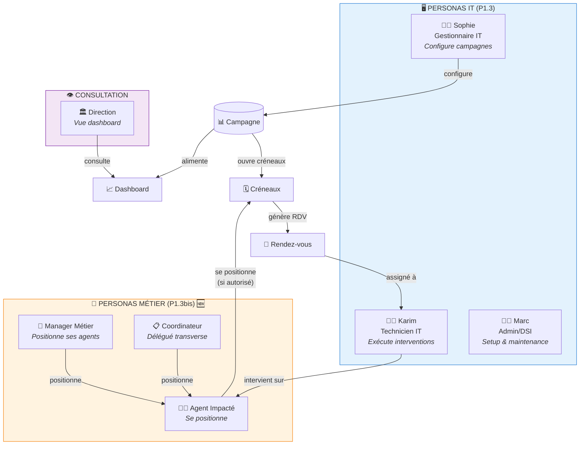
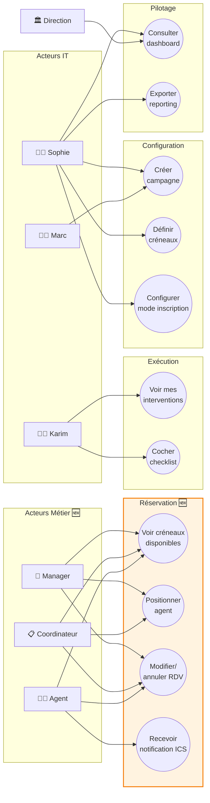
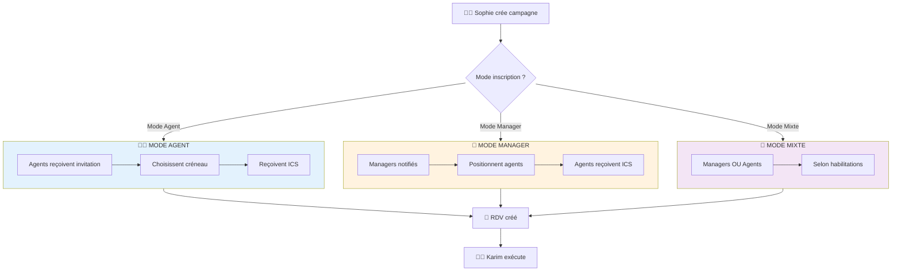
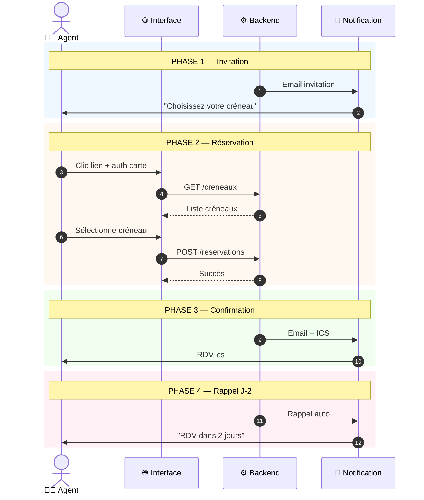
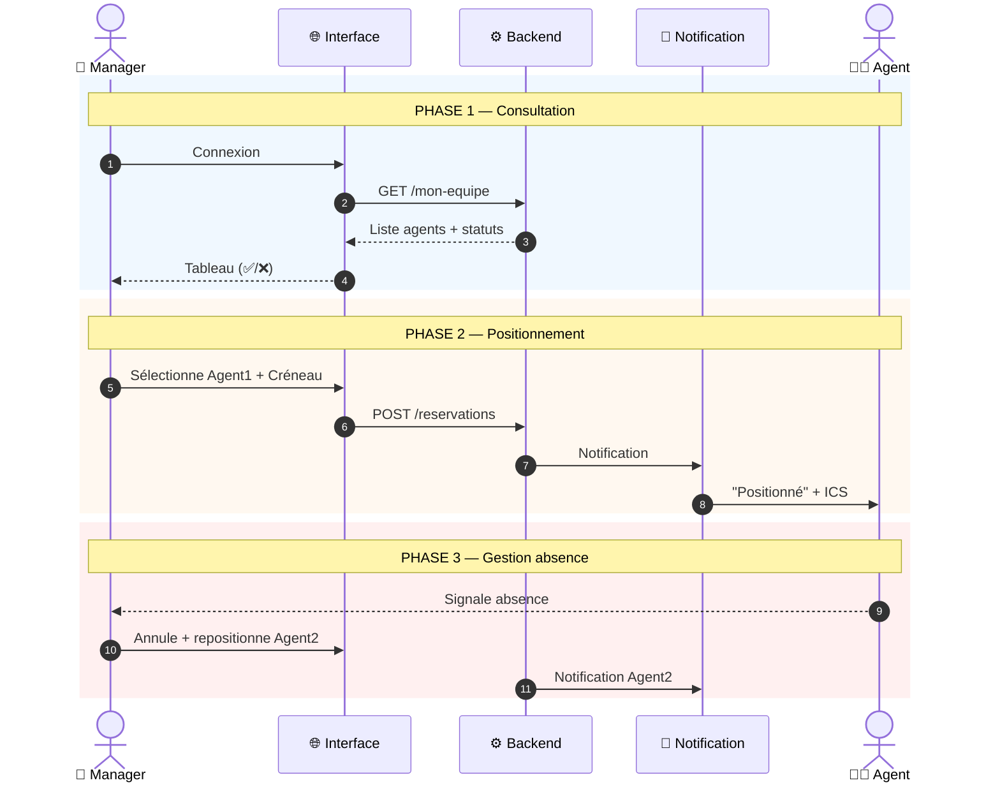
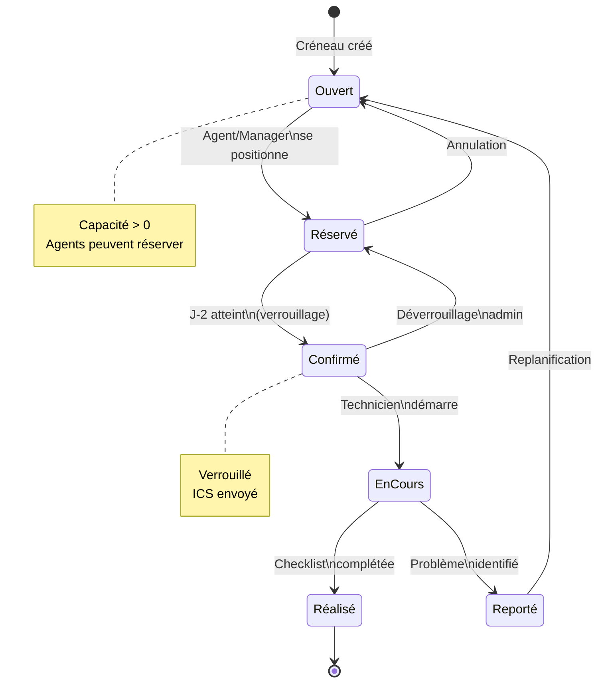
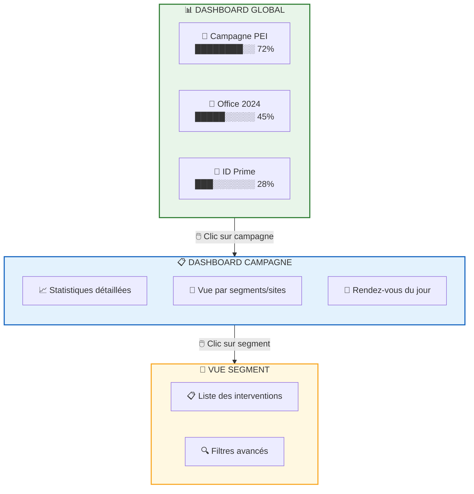
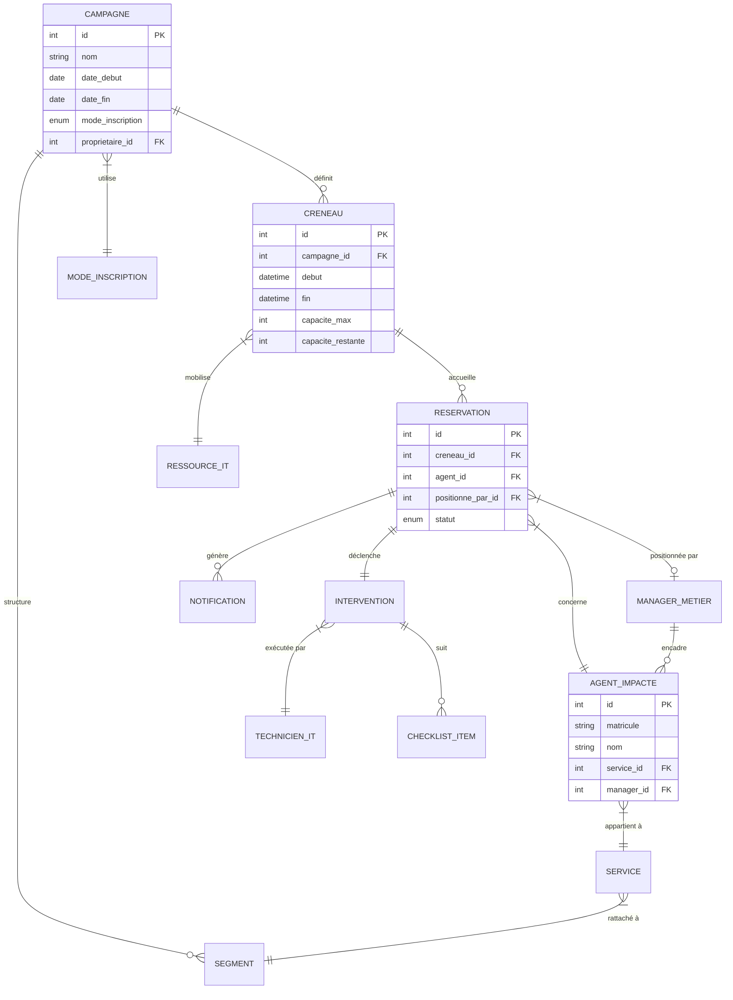

# P1.3bis - Recueil de Besoins CPAM (PV Réunion de Généricisation)

━━━━━━━━━━━━━━━━━━━━━━━━━━━━━━━━━━━━━━━━━━━━━━━
📋 **PROCÈS-VERBAL DE RÉUNION — RECUEIL DE BESOINS** Confiance globale : **90%**
━━━━━━━━━━━━━━━━━━━━━━━━━━━━━━━━━━━━━━━━━━━━━━━

---

## 1. Métadonnées de la Réunion

| Élément       | Valeur                                                                |
| ------------- | --------------------------------------------------------------------- |
| **Date**      | 21/01/2026                                                            |
| **Durée**     | ~45 minutes                                                           |
| **Format**    | Visioconférence                                                       |
| **Objet**     | Recueil et agrégation des besoins pour la généricisation du POC "TAM" |
| **Animateur** | Alexandre (DSI CPAM 92 - Nanterre)                                    |

### 1.1 Participants

| Nom           | Organisme | Rôle                          | Présence |
| ------------- | --------- | ----------------------------- | -------- |
| **Alexandre** | CPAM 92   | DSI / Développeur / Animateur | ✅        |
| **Laurent**   | CPAM 77   | DSI / Contributeur            | ✅        |
| **Thierry**   | CPAM 93   | Contributeur                  | ✅        |
| **Stéphane**  | CPAM 93   | Contributeur                  | ✅        |
| **Benjamin**  | CPAM 78   | Contributeur                  | ✅        |
| **Serge**     | CPAM 95   | Contributeur                  | ✅        |

### 1.2 Sessions complémentaires prévues

|Date|Objet|Participants attendus|
|---|---|---|
|**27 janvier**|Session de rattrapage|Nicolas, Christophe, cadres équipe Serge|
|**3 février**|Club DSI + Démo MVP|Tous (Versailles, accueil Benjamin)|

---

## 2. Contexte et Objectifs

### 2.1 Rappel du contexte

L'application **TAM-RDV** a été développée pour la migration DRSM→CPAM. Cette application a fait ses preuves mais n'est pas générique/réutilisable en l'état. L'objectif est de la génériciser pour répondre aux besoins de plusieurs CPAM.

### 2.2 Objectifs de la réunion

1. Recueillir les besoins complémentaires des CPAM utilisatrices
2. Identifier les fonctionnalités manquantes par rapport à TAM-RDV
3. Qualifier les points de friction et éléments d'amélioration

### 2.3 Périmètre de discussion

Toutes les features de TAM-RDV sont considérées comme acquises. 
La discussion porte sur les **besoins complémentaires** uniquement.

---

## 3. Nouveaux Personas Identifiés

Cette réunion a révélé **3 nouveaux personas** non documentés dans P1.3, tous côté "métier/bénéficiaires" (par opposition aux personas IT existants).

> **Référence** : Pour le format Jobs-to-be-Done, matrices de besoins et critères UX, voir P1.3.

### 3.1 Vue d'ensemble

|Persona|Description|Usage|Priorité UX|
|---|---|---|---|
|🆕 **Agent Impacté**|Salarié dont le poste va être migré/modifié|Ponctuel (se positionne)|**CRITIQUE** — Zéro formation|
|🆕 **Manager Métier**|Encadrant qui positionne ses agents et préserve la continuité de service|Ponctuel mais intensif|**HAUTE** — Vue équipe|
|🆕 **Coordinateur**|Délégué habilité sans lien hiérarchique|Ponctuel|Moyenne — Flexibilité droits|

### 3.2 Cartographie complète des personas OpsTracker

### 3.3 Agent Impacté (End-User Métier)

**Profil** :

|Caractéristique|Description|
|---|---|
|**Qui**|Agent CPAM (PFS, back-office, médical, etc.) dont le poste/équipement va être impacté|
|**Contexte**|N'est PAS un informaticien, c'est un "client interne" de l'opération|
|**Contrainte métier**|Doit continuer à assurer son activité pendant l'opération|
|**Fréquence d'usage**|Ponctuel (1-2 fois par an)|
|**Compétence numérique**|Variable (de basique à correcte)|

**Jobs-to-be-Done** :

|Type|Job|
|---|---|
|🛠 **Fonctionnel**|Choisir un créneau compatible avec mes contraintes professionnelles|
|❤️ **Émotionnel**|Ne pas subir l'opération IT, être acteur de mon planning|
|🤝 **Social**|Ne pas bloquer mon service / mes collègues|

**Besoins identifiés** :

|Type|Besoin|Priorité|
|---|---|---|
|**Explicite**|Voir les créneaux disponibles et en choisir un|Must Have|
|**Explicite**|Pouvoir modifier/annuler mon créneau si empêchement|Must Have|
|**Implicite**|Recevoir une confirmation + rappel dans mon agenda|Should Have|
|**Implicite**|Interface ultra-simple (pas de formation, usage ponctuel)|Must Have|
|**Latent**|Savoir ce qui va se passer lors de l'intervention|Could Have|

**Critères UX Non-Négociables** :

|Critère|Justification|
|---|---|
|**⚡ Prise en main immédiate**|Usage très ponctuel, pas de formation possible|
|**🎯 Parcours linéaire**|Voir créneaux → Choisir → Confirmer (3 clics max)|
|**📱 Responsive**|Certains agents sont en mobilité|
|**🔐 Auth transparente**|Carte agent = pas de login/mot de passe|

### 3.4 Manager Métier (Encadrant hors IT)

**Profil** :

|Caractéristique|Description|
|---|---|
|**Qui**|Responsable d'équipe, chef de service, manager de proximité|
|**Contexte**|N'est PAS un informaticien, gère une équipe "métier" impactée|
|**Responsabilité**|Continuité de service de son équipe pendant l'opération|
|**Vision**|Connaît les contraintes individuelles (présentéisme, absences, activités)|
|**Fréquence d'usage**|Ponctuel mais plus intensif que l'agent|

**Jobs-to-be-Done** :

|Type|Job|
|---|---|
|🛠 **Fonctionnel**|Positionner mes agents sur des créneaux en préservant la continuité de service|
|🛠 **Fonctionnel**|Remplacer/repositionner un agent en cas d'absence ou d'imprévu|
|❤️ **Émotionnel**|Garder le contrôle sur l'organisation de mon service|
|🤝 **Social**|Être vu comme un manager qui protège son équipe des perturbations|

**Frustrations actuelles (AS-IS)** :

|Sévérité|Frustration|
|---|---|
|🔴|Pas de vision consolidée des créneaux vs disponibilités|
|🔴|Risque de désorganisation si agents s'inscrivent sans coordination|
|🟠|Recensement fastidieux par Excel|

**Besoins identifiés** :

|Type|Besoin|Priorité|
|---|---|---|
|**Explicite**|Voir la liste de mes agents et les créneaux disponibles|Must Have|
|**Explicite**|Positionner mes agents sur des créneaux (pour eux)|Must Have|
|**Explicite**|Modifier/annuler un positionnement si absence|Must Have|
|**Implicite**|Vue synthétique : qui est positionné, qui ne l'est pas encore|Should Have|
|**Implicite**|Ne pas avoir tous mes agents le même jour|Should Have|
|**Latent**|Être notifié si un agent se désiste|Could Have|

**Critères UX Non-Négociables** :

|Critère|Justification|
|---|---|
|**👥 Vue équipe**|Liste des agents avec statut (positionné/non positionné)|
|**📅 Vue planning**|Visualisation des créneaux avec répartition équipe|
|**🔄 Actions rapides**|Positionner, déplacer, annuler en quelques clics|
|**⚠️ Alertes visuelles**|Agents non positionnés, créneaux surchargés|

### 3.5 Coordinateur/Délégué

**Profil** :

|Caractéristique|Description|
|---|---|
|**Qui**|Assistant(e), coordinateur(trice), référent(e) désigné(e)|
|**Contexte**|Personne de confiance qui connaît l'organisation et les agents|
|**Légitimité**|Délégation explicite (pas de lien hiérarchique)|
|**Périmètre**|Peut être transverse (plusieurs services)|

**Implication conception** :

- Le système de droits doit permettre d'habiliter des utilisateurs "non-managers" à positionner des agents
- La notion de "périmètre" n'est pas forcément alignée sur l'organigramme hiérarchique

### 3.6 Matrice des interactions entre personas

|Qui|Fait quoi|Pour qui|Via quelle interface|
|---|---|---|---|
|Sophie (Gestionnaire IT)|Configure la campagne, ouvre les créneaux|Tous|Console d'administration|
|Karim (Technicien IT)|Exécute l'intervention|Agent impacté|Interface terrain|
|Manager Métier|Positionne ses agents|Ses agents|Interface réservation (vue manager)|
|Agent Impacté|Se positionne (si autorisé)|Lui-même|Interface réservation (vue agent)|
|Coordinateur|Positionne pour plusieurs services|Agents délégués|Interface réservation (vue manager)|
|Direction|Consulte l'avancement|-|Dashboard lecture seule|

---

## 4. Nouveaux Besoins Fonctionnels

### 4.1 Interface End-User "Type Doctolib"

**Demandeurs** : Benjamin (initiateur), Thierry, Stéphane, Laurent

**Description** : Les utilisateurs finaux (agents ou managers) peuvent réserver des créneaux comme sur Doctolib, avec authentification par carte agent.

|Aspect|Spécification|
|---|---|
|**Principe**|Réservation de créneaux en self-service ou par délégation|
|**Authentification**|Carte agent / Compte AD (reconnaissance automatique)|
|**Unicité**|Une seule inscription possible par agent|
|**Modification**|Possibilité de se désinscrire pour se repositionner|
|**Verrouillage**|Le créneau devient non modifiable à une date/heure définie|

**Avantages identifiés** :
- Évite le recensement Excel par les managers
- Identification fiable des agents (vs Framadate anonyme)
- Responsabilisation des agents ou contrôle managérial (selon configuration)

**Point technique** : La CPAM 75 dispose déjà d'une brique similaire fonctionnant avec la carte agent. Possibilité d'export/intégration à évaluer.

### 4.2 Gestion des Ressources IT (Capacité)

**Demandeurs** : Stéphane (initiateur), Laurent, Thierry

**Description** : L'IT définit sa capacité d'intervention (ressources disponibles par jour/demi-journée). Le nombre de créneaux ouverts est calculé automatiquement.

**Paramètres à configurer par campagne** :

|Paramètre|Description|Exemple|
|---|---|---|
|**Nombre de ressources**|Techniciens disponibles par jour/demi-journée|2, 3, 5...|
|**Durée intervention**|Temps moyen par intervention|30min, 1h, 2h, 4h|
|**Créneaux simultanés**|Nombre de RDV possibles en parallèle|1, 2, 5, 10...|
|**Granularité**|Finesse du créneau|Heure, demi-journée, journée|

**Exemple concret** : Migration Office (1h) avec 2 ressources = 16 RDV/jour. Migration PC (4h) avec 2 ressources = 4 RDV/jour.

### 4.3 Mode d'Inscription Configurable par Campagne

**Demandeurs** : Consensus général (Serge, Benjamin, Stéphane)

**Contexte** : Divergence organisationnelle identifiée entre CPAM. Certaines préfèrent responsabiliser les agents (inscription autonome), d'autres préfèrent que les managers contrôlent (présentéisme, continuité de service).

**Spécification retenue** :

|Option|Description|Cas d'usage|
|---|---|---|
|**Mode Agent**|Tous les agents concernés peuvent s'inscrire|Responsabilisation, démarche volontaire|
|**Mode Manager**|Seuls les managers positionnent leurs agents|Contrôle organisationnel, présentéisme|
|**Mode Liste**|Liste spécifique d'utilisateurs habilités|Délégation à un coordinateur, assistants|
|**Mode Mixte**|Combinaison selon profils|Organisation hybride par service|

**Configuration** : À définir à la création de chaque campagne.

**Implication technique** :
- Mode Agent : récupération automatique des infos via carte agent
- Mode Manager : liste déroulante des agents du périmètre du manager

### 4.4 Multi-Campagnes Concomitantes

**Demandeurs** : Serge (initiateur), Stéphane, Laurent

**Description** : Possibilité de gérer plusieurs campagnes en parallèle (ex: PEI + Office 2024 + ID Prime) avec un dashboard global.

**Spécifications** :

|Niveau|Contenu|Navigation|
|---|---|---|
|**Global**|Toutes campagnes en cours avec taux d'avancement et échéances|Liste/onglets/dropdown|
|**Campagne**|Dashboard détaillé d'une campagne spécifique|Clic sur campagne|
|**Segment**|Vue filtrée par segment (site, service...)|Filtres dans campagne|

**Précision** : Les campagnes n'ont pas besoin d'être comparables entre elles (une campagne ID Prime et une campagne PEI sont indépendantes).

### 4.5 Propriété et Cloisonnement des Campagnes

**Demandeurs** : Stéphane (initiateur), Alexandre

**Description** : Chaque campagne a un propriétaire. Les campagnes peuvent être cloisonnées par service (ex: DSI ne voit pas les campagnes SIRH).

|Aspect|Spécification|
|---|---|
|**Propriétaire**|Chaque campagne a un propriétaire (créateur)|
|**Visibilité**|Par défaut, seul le propriétaire et les utilisateurs habilités voient la campagne|
|**Partage**|Le propriétaire peut ouvrir les droits à d'autres profils/services|

**Extension du périmètre** : L'outil peut servir au-delà de l'IT (campagnes RH, gestion des photos ID Prime, etc.).

### 4.6 Notifications et Intégration Agenda (ICS)

**Demandeurs** : Benjamin (initiateur), Thierry, Laurent

**Description** : Envoi automatique d'emails avec fichier ICS pour intégration dans l'agenda Outlook.

|Type de notification|Contenu|Timing|
|---|---|---|
|**Email de confirmation**|Détails du RDV + fichier ICS|À l'inscription|
|**Email de rappel**|Rappel du RDV + fichier ICS|J-2 (paramétrable)|
|**Email de modification**|Nouveau créneau + ICS mis à jour|À chaque modification|

**Avantages** : Évite les oublis, preuve que l'information a été transmise.

**Référence technique** : La CPAM 78 a déjà implémenté cette fonctionnalité sur une application de réunion.

### 4.7 Précisions sur les Checklists

**Demandeurs** : Thierry, Alexandre

**Problème rappelé** : Dans TAM, la réorganisation des items de checklist pouvait casser le suivi existant.

**Simplification retenue** :

|Aspect|Comportement|
|---|---|
|**Ajout d'items**|Uniquement en fin de liste (séquentiel)|
|**Suppression**|Non autorisée sur checklists en cours|
|**Réordonnancement**|Non autorisé sur checklists en cours|
|**Protection**|Checklist commencée = figée pour cet agent|

**Priorisation** : Cette fonctionnalité avancée n'est pas dans le MVP. Priorité au socle fonctionnel.

### 4.8 Base Documentaire — Points de Vigilance

**Demandeurs** : Serge, Alexandre

**Confirmation** : La base documentaire reste hébergée dans l'outil (comme TAM).

**Cas d'usage** : Plans de déploiement, procédures pour techniciens, scripts, fichiers .exe/.ini.

**Point de vigilance** : Les fichiers lourds (.exe, .ini) peuvent impacter les performances. À terme, prévoir une interopérabilité avec une base documentaire externe.

---

## 5. Modélisations

### 5.1 Diagramme de cas d'usage

### 5.2 Flux selon Mode d'Inscription

### 5.3 Parcours Agent Impacté (Self-Service)

### 5.4 Parcours Manager Métier

### 5.5 Cycle de Vie d'un Rendez-vous

### 5.6 Dashboard Multi-Campagnes

### 5.7 Modèle de Données Simplifié

---

## 6. Décisions et Actions

### 6.1 Décisions Validées en Séance

|#|Décision|Consensus|
|---|---|---|
|D1|Mode inscription configurable par campagne (agent/manager/liste)|✅ Unanime|
|D2|Dashboard global multi-campagnes|✅ Unanime|
|D3|Modèle Portail Applications Locales (CPAM 92 éditeur, instances par CPAM)|✅ Unanime|
|D4|Checklist en ajout séquentiel uniquement|✅ Unanime|
|D5|Notifications avec ICS|✅ Unanime|
|D6|Cloisonnement par propriétaire de campagne|✅ Unanime|
|D7|3 nouveaux personas côté métier (Agent, Manager, Coordinateur)|✅ Implicite|
|D8|Interface "Doctolib" avec double parcours (agent / manager)|✅ Unanime|

### 6.2 Actions à Mener

| #   | Action                 | Responsable | Échéance       |
| --- | ---------------------- | ----------- | -------------- |
| A1  | Livrer MVP fonctionnel | Alexandre   | 26/01/2026     |
| A2  | Session rattrapage     | Alexandre   | 27/01/2026     |
| A3  | Préparer démo Club DSI | Alexandre   | Club DSI 03/02 |

---

## 7. Synthèse

### 7.1 Nouveaux Personas (à intégrer dans P1.3)

| #   | Persona            | Description                                 | Priorité UX                              |
| --- | ------------------ | ------------------------------------------- | ---------------------------------------- |
| 🆕  | **Agent Impacté**  | Salarié CPAM concerné par l'opération       | **CRITIQUE** — Simplicité maximale       |
| 🆕  | **Manager Métier** | Encadrant hors IT qui positionne ses agents | **HAUTE** — Vue équipe + actions rapides |
| 🆕  | **Coordinateur**   | Personne habilitée sans lien hiérarchique   | Moyenne — Flexibilité droits             |

### 7.2 Nouveaux Besoins (à intégrer dans P4.1)

|#|Besoin|Priorité|Impact|
|---|---|---|---|
|N1|Interface end-user "Doctolib"|🔴 Haute|Nouveau persona, architecture|
|N2|Gestion capacité ressources IT|🔴 Haute|Logique métier|
|N3|Abaques durée/créneaux|🟠 Moyenne|Configuration|
|N4|Mode inscription configurable|🔴 Haute|Droits, UX|
|N5|Multi-campagnes concomitantes|🔴 Haute|Architecture dashboard|
|N6|Propriété/cloisonnement campagnes|🟠 Moyenne|Droits|
|N7|Notifications ICS|🟠 Moyenne|Intégration|
|N8|Extension RH/autres directions|🟢 Basse (V2)|Périmètre|

### 7.3 Précisions sur Besoins Existants

|#|Besoin existant|Précision apportée|
|---|---|---|
|E1|Checklist versioning|Ajouts séquentiels uniquement (fin de liste)|
|E2|Base documentaire|Hébergée dans l'outil, vigilance capacité fichiers lourds|
|E3|Export configuration|Template CSV partageable entre CPAM|

### 7.4 Risques Identifiés

| #   | Risque                                       | Probabilité | Impact | Mitigation                               |
| --- | -------------------------------------------- | ----------- | ------ | ---------------------------------------- |
| R1  | Divergence organisationnelle entre CPAM      | Haute       | Moyen  | Configurabilité maximale par campagne    |
| R2  | Complexité croissante (feature creep)        | Moyenne     | Fort   | MVP strict, priorisation, itérations     |
| R3  | Capacité stockage docs (fichiers lourds)     | Moyenne     | Moyen  | Limiter taille, prévoir interopérabilité |
| R4  | Adoption end-users (interface trop complexe) | Faible      | Fort   | UX "Doctolib", simplicité maximale       |

---

## 8. Annexes

### A. Organisations Représentées

|CPAM|Département|Référent(s)|Particularités|
|---|---|---|---|
|**92 - Nanterre**|Hauts-de-Seine|Alexandre|Éditeur, hébergeur|
|**75 - Paris**|Paris|Laurent|App RDV existante, planning prêt|
|**93**|Seine-Saint-Denis|Thierry, Stéphane|Équipe séparée DSI/SIRH|
|**78 - Versailles**|Yvelines|Benjamin|Accueil Club DSI 3/02|
|**37**|Indre-et-Loire|(non représenté)|Mentionné dans P0|
|**77**|Seine-et-Marne|(non représenté)|Mentionné dans P0|

### B. Fonctionnalités TAM-RDV Confirmées (Acquis)

|Fonctionnalité|Statut|
|---|---|
|Segmentation par site|✅ Conservé|
|Champs personnalisables|✅ Conservé|
|Gestion des statuts|✅ Conservé|
|Dashboard avec métriques|✅ Conservé|
|Import/Export CSV|✅ Conservé|
|Base documentaire liée aux checklists|✅ Conservé|
|Multi-sites par CPAM|✅ Conservé|
|Accès consultation pour Direction|✅ Conservé|
