# OpsTracker — Dossier Complet pour Mutualisation Inter-Organisation

**Application de Pilotage d'Opérations IT de Masse**

---

> **Document destiné aux DSI des organisations d'Île-de-France**  
> **Version** : 2.1.1 (Tag v2.1.1)  
> **Date** : 27 janvier 2026  
> **Éditeur** : Organisation des Hauts-de-Seine (92)  
> **Contact** : DSI Organisation — Alexandre  
> **Licence** : EUPL 1.2

---

## Table des Matières

1. [Résumé Exécutif](https://claude.ai/chat/df555cb1-3c64-45c8-8c49-4f09668fa970#1-r%C3%A9sum%C3%A9-ex%C3%A9cutif)
2. [Contexte et Genèse du Projet](https://claude.ai/chat/df555cb1-3c64-45c8-8c49-4f09668fa970#2-contexte-et-gen%C3%A8se-du-projet)
3. [Vision et Objectifs Stratégiques](https://claude.ai/chat/df555cb1-3c64-45c8-8c49-4f09668fa970#3-vision-et-objectifs-strat%C3%A9giques)
4. [Architecture Fonctionnelle](https://claude.ai/chat/df555cb1-3c64-45c8-8c49-4f09668fa970#4-architecture-fonctionnelle)
5. [Architecture Technique](https://claude.ai/chat/df555cb1-3c64-45c8-8c49-4f09668fa970#5-architecture-technique)
6. [Fonctionnalités Détaillées](https://claude.ai/chat/df555cb1-3c64-45c8-8c49-4f09668fa970#6-fonctionnalit%C3%A9s-d%C3%A9taill%C3%A9es)
7. [Résultats et Métriques](https://claude.ai/chat/df555cb1-3c64-45c8-8c49-4f09668fa970#7-r%C3%A9sultats-et-m%C3%A9triques)
8. [ROI et Valeur Métier](https://claude.ai/chat/df555cb1-3c64-45c8-8c49-4f09668fa970#8-roi-et-valeur-m%C3%A9tier)
9. [Conformité et Sécurité](https://claude.ai/chat/df555cb1-3c64-45c8-8c49-4f09668fa970#9-conformit%C3%A9-et-s%C3%A9curit%C3%A9)
10. [Retour d'Expérience et Enseignements](https://claude.ai/chat/df555cb1-3c64-45c8-8c49-4f09668fa970#10-retour-dexp%C3%A9rience-et-enseignements)
11. [Roadmap et Évolutions](https://claude.ai/chat/df555cb1-3c64-45c8-8c49-4f09668fa970#11-roadmap-et-%C3%A9volutions)
12. [Guide de Déploiement](https://claude.ai/chat/df555cb1-3c64-45c8-8c49-4f09668fa970#12-guide-de-d%C3%A9ploiement)
13. [Annexes Techniques](https://claude.ai/chat/df555cb1-3c64-45c8-8c49-4f09668fa970#13-annexes-techniques)

---

## 1. Résumé Exécutif

### 1.1 Le Problème

Les Organisation gèrent régulièrement des opérations IT de masse impliquant des centaines voire des milliers de cibles : migrations applicatives, déploiements matériels, renouvellements de parc, mises à jour sécuritaires. Ces opérations sont aujourd'hui pilotées via des fichiers Excel ad hoc.

```mermaid
flowchart LR
    subgraph Problèmes["❌ Situation Actuelle - Excel"]
        A["📊 Consolidation<br/>chronophage"]
        B["⚠️ Données<br/>non fiables"]
        C["🔍 Absence<br/>traçabilité"]
        D["✍️ Double saisie<br/>terrain"]
        E["👁️ Visibilité<br/>limitée"]
    end
    
    A --> A1["4-6h/semaine"]
    B --> B1["Conflits versions"]
    C --> C1["Pas d'audit trail"]
    D --> D1["Report manuel"]
    E --> E1["Pas de temps réel"]
    
    style Problèmes fill:#ffebee
```

### 1.2 La Solution

**OpsTracker** est une application web de pilotage d'opérations IT de masse conçue spécifiquement pour le contexte Organisation.

```mermaid
flowchart LR
    subgraph Solution["✅ OpsTracker"]
        A["🎯 Source unique<br/>de vérité"]
        B["📊 Dashboard<br/>temps réel"]
        C["✅ Checklists<br/>protégées"]
        D["🎫 Réservation<br/>Doctolib-style"]
        E["🛡️ Conformité<br/>native"]
    end
    
    A --> A1["Centralisé"]
    B --> B1["< 5 min"]
    C --> C1["Snapshot Pattern"]
    D --> D1["3 clics max"]
    E --> E1["RGAA + EUPL"]
    
    style Solution fill:#e8f5e9
```

### 1.3 Résultats Clés

|Indicateur|Avant|Après|Amélioration|
|---|---|---|---|
|Temps de consolidation reporting|4-6 heures|< 5 minutes|**-98%**|
|État des lieux campagne|2-4 heures|< 1 minute|**-99%**|
|Mise à jour terrain|Fin de journée|Temps réel|**Immédiat**|
|Double saisie technicien|Systématique|Éliminée|**100%**|
|Formation requise|Variable|Zéro|**Adoption immédiate**|

### 1.4 Chiffres Clés du Projet

```mermaid
pie showData
    title "Répartition des 111 User Stories"
    "V1 - Core (76 US)" : 76
    "V2 - Réservation (26 US)" : 26
    "V2.1 - Évolutions (9 US)" : 9
```

|Métrique|Valeur|
|---|---|
|User Stories implémentées|85 (V1) + 26 (V2) = **111 US**|
|Tests automatisés|**314 tests** (240 V1 + 74 V2)|
|Score Audit Qualité V2.1.1|**95/100**|
|Score Évaluation P7|**8.2/10** (SUCCÈS)|
|Couverture code|**~80%**|
|Durée de développement V2|**~7 semaines**|
|ROI estimé|**16.5 jours-homme/an** économisés|

---

## 2. Contexte et Genèse du Projet

### 2.1 Origine : Le POC TAM

```mermaid
timeline
    title Genèse du Projet OpsTracker
    section POC TAM
        2024 : Migration TAM IDF
             : Application spécifique développée
             : Validation des concepts clés
    section Demande Multi-Organisation
        2025-Q1 : Expression d'intérêt Org. B, 77, 78, 93
                : Besoin d'outil générique identifié
    section Développement
        2025-Q2 : Lancement projet OpsTracker
                : Framework BA-AI appliqué
        2025-Q4 : MVP puis V1 livrées
    section Production
        2026-01 : V2.1.1 en production
                : Prêt pour mutualisation
```

|Module POC TAM|Retour Terrain|Décision OpsTracker|
|---|---|---|
|Planification centralisée|✅ Très apprécié|Généralisé|
|Segmentation sites/services|✅ Source unique de vérité|Paramétrable|
|Checklists par phase|⚠️ Problème d'écrasement|**Protégées (Snapshot)**|
|Dashboard avancement|✅ Visibilité direction|Configurable|
|Base documentaire|✅ Accès contextualisé|Conservée|

### 2.2 Expression du Besoin Multi-Organisation

```mermaid
flowchart TB
    subgraph Organisation92["🏢 Organisation - Éditeur"]
        OT["OpsTracker<br/>Code source"]
    end
    
    subgraph Demandeurs["🤝 Organisation Intéressées"]
        Organisation75["Org. B - Paris<br/>App RDV carte agent"]
        Organisation77["Org. C - Seine-et-Marne<br/>Segmentation territoire"]
        Organisation78["Org. D - Yvelines<br/>Checklists standards"]
        Organisation93["Org. E - Seine-Saint-Denis<br/>Dashboard temps réel"]
    end
    
    OT -.->|"Instance"| Organisation75
    OT -.->|"Instance"| Organisation77
    OT -.->|"Instance"| Organisation78
    OT -.->|"Instance"| Organisation93
    
    style Organisation92 fill:#e3f2fd
    style Demandeurs fill:#fff3e0
```

### 2.3 Positionnement Stratégique


|Contrainte|Solutions Enterprise|OpsTracker|
|---|---|---|
|Symfony obligatoire|❌|✅|
|Self-hosted|❌ (SaaS)|✅|
|EUPL 1.2 / Open Source|❌ (Propriétaire)|✅|
|RGAA 4.1 natif|⚠️ (Partiel)|✅|
|Budget < 50k€/an|❌|✅ (0€ licence)|
|Référençable SILL|❌|✅ (Cible)|

---

## 3. Vision et Objectifs Stratégiques

### 3.1 Le Manifeste

> _"Chaque opération IT pilotée, pas subie. Chaque technicien équipé, pas perdu. Chaque organisation autonome, pas dépendante."_

### 3.2 Transformation AS-IS → TO-BE

```mermaid
flowchart LR
    subgraph ASIS["😫 AS-IS - Avant"]
        A1["Excel ad hoc"]
        A2["Consolidation manuelle"]
        A3["Checklists PDF statiques"]
        A4["Docs dispersés"]
        A5["Mail/Teams dispersé"]
    end
    
    subgraph TOBE["😊 TO-BE - Après"]
        B1["Source unique centralisée"]
        B2["Dashboard temps réel"]
        B3["Checklists interactives"]
        B4["Docs contextuels liés"]
        B5["Tout-en-un intégré"]
    end
    
    A1 -->|"OpsTracker"| B1
    A2 -->|"OpsTracker"| B2
    A3 -->|"OpsTracker"| B3
    A4 -->|"OpsTracker"| B4
    A5 -->|"OpsTracker"| B5
    
    style ASIS fill:#ffebee
    style TOBE fill:#e8f5e9
```

### 3.3 North Star Metric

```mermaid
flowchart TB
    NSM["🌟 NORTH STAR METRIC<br/>Taux d'interventions avec statut<br/>mis à jour par le technicien assigné"]
    
    NSM --> P1["📈 Productivité<br/>Opérations terminées"]
    NSM --> P2["👥 Adoption terrain<br/>Karim utilise l'outil"]
    NSM --> P3["✅ Qualité données<br/>Source unique de vérité"]
    
    P1 & P2 & P3 --> T1["🎯 Cible: >90%"]
    
    style NSM fill:#fff9c4
    style T1 fill:#c8e6c9
```

### 3.4 Objectifs & KPIs

|KPI|Métrique|Baseline|Cible|Statut|
|---|---|---|---|---|
|**KPI-1**|Temps moyen état des lieux|2-4h|**< 5 min**|✅ < 1 min|
|**KPI-2**|% opérations MAJ J-même|~30%|**> 90%**|✅ Temps réel|
|**KPI-3**|Time to First Value|Infini|**< 30 min**|✅ Validé|
|**KPI-4**|Taux adoption techniciens|N/A|**> 80%**|⏳ À mesurer|

---

## 4. Architecture Fonctionnelle

### 4.1 Vue d'Ensemble des Modules

```mermaid
flowchart TB
    subgraph Core["🎯 MODULES CORE - V1"]
        PLAN["📅 PLANNING<br/>Campagnes, Segments<br/>Opérations, Import CSV"]
        DASH["📊 DASHBOARD<br/>KPIs temps réel<br/>Export PDF, Partage"]
        TERR["🔧 TERRAIN<br/>Vue interventions<br/>Checklists, Docs"]
        CONF["⚙️ CONFIG<br/>Champs dynamiques<br/>Workflows, Templates"]
    end
    
    subgraph V2["🆕 MODULE RÉSERVATION - V2"]
        CREN["📆 CRÉNEAUX<br/>Génération, Capacité<br/>Verrouillage J-X"]
        BOOK["🎫 RÉSERVATION<br/>Agent, Manager<br/>Coordinateur"]
        NOTIF["📧 NOTIFICATIONS<br/>Email + ICS<br/>Rappels SMS"]
    end
    
    subgraph Trans["🔄 TRANSVERSE"]
        AUTH["🔐 AUTH<br/>Utilisateurs, Rôles"]
        AUDIT["📝 AUDIT<br/>Trail complet"]
        DOCS["📁 DOCUMENTS<br/>Base contextuelle"]
    end
    
    PLAN --> DASH
    PLAN --> TERR
    PLAN --> CREN
    CREN --> BOOK
    BOOK --> NOTIF
    
    AUTH --> Core
    AUTH --> V2
    AUDIT -.-> Core
    AUDIT -.-> V2
    
    style Core fill:#e3f2fd
    style V2 fill:#fff3e0
    style Trans fill:#f3e5f5
```

### 4.2 Personas et Parcours

```mermaid
flowchart TB
    subgraph Personas["👥 PERSONAS"]
        SOPHIE["👩‍💼 SOPHIE<br/>Gestionnaire Opérations<br/>Configure, pilote, reporte"]
        KARIM["👨‍🔧 KARIM<br/>Technicien Terrain<br/>Exécute, coche, met à jour<br/>💻 Laptop uniquement"]
        AGENT["👤 AGENT<br/>End-User Métier<br/>Réserve son créneau"]
        MANAGER["👔 MANAGER<br/>Responsable Équipe<br/>Positionne ses agents"]
    end
    
    subgraph Interfaces["🖥️ INTERFACES"]
        ADMIN["EasyAdmin<br/>Configuration"]
        FRONT["Twig + Turbo<br/>Application métier"]
        TOKEN["Accès Token<br/>Sans authentification"]
    end
    
    SOPHIE --> ADMIN
    SOPHIE --> FRONT
    KARIM --> FRONT
    AGENT --> TOKEN
    MANAGER --> FRONT
    
    style SOPHIE fill:#e1bee7
    style KARIM fill:#b3e5fc
    style AGENT fill:#c8e6c9
    style MANAGER fill:#ffe0b2
```

**⚠️ Important** : L'interface est optimisée **desktop/laptop**, pas mobile. Les techniciens (Karim) utilisent leur laptop sur le terrain.

#### Parcours Sophie — Gestionnaire d'Opérations IT

```mermaid
sequenceDiagram
    participant S as 👩‍💼 Sophie
    participant OT as 🖥️ OpsTracker
    participant DB as 🗄️ PostgreSQL
    
    S->>OT: 1. Créer nouvelle campagne
    OT->>DB: Enregistrer campagne
    
    S->>OT: 2. Importer CSV (≤100k lignes)
    OT->>DB: Créer opérations
    
    S->>OT: 3. Configurer champs + statuts
    OT->>DB: Sauvegarder config JSONB
    
    S->>OT: 4. Attacher checklists + docs
    OT->>DB: Lier templates
    
    loop Suivi quotidien
        S->>OT: 5. Consulter dashboard
        OT->>DB: Agréger statistiques
        OT-->>S: KPIs temps réel
    end
    
    S->>OT: 6. Exporter PDF
    OT-->>S: Rapport direction
```

#### Parcours Karim — Technicien Terrain

```mermaid
sequenceDiagram
    participant K as 👨‍🔧 Karim (Laptop)
    participant OT as 🖥️ OpsTracker
    participant DB as 🗄️ PostgreSQL
    participant S as 👩‍💼 Sophie (Dashboard)
    
    K->>OT: Ouvrir "Mes interventions"
    OT->>DB: Filtrer par technicien
    OT-->>K: Liste 6 interventions du jour
    
    K->>OT: Sélectionner intervention #1
    OT-->>K: Détails + Checklist + Docs
    
    loop Pour chaque étape
        K->>OT: ✓ Cocher étape
        OT->>DB: Enregistrer progression
    end
    
    K->>OT: Statut → "Réalisé"
    OT->>DB: MAJ temps réel
    OT-->>K: ✅ Confirmation
    
    Note over S: Sophie voit le changement<br/>instantanément sur son dashboard
```

#### Parcours Agent — Réservation (V2)

```mermaid
sequenceDiagram
    participant A as 👤 Agent Métier
    participant E as 📧 Email
    participant OT as 🖥️ OpsTracker
    participant CAL as 📅 Outlook
    
    OT->>E: Email invitation + lien token
    E-->>A: Réception invitation
    
    A->>OT: Clic sur lien personnalisé
    OT-->>A: Liste créneaux disponibles
    
    A->>OT: Sélectionner créneau (3 clics)
    OT-->>A: ✅ Confirmation
    
    OT->>E: Email confirmation + ICS
    E-->>A: Réception
    
    A->>CAL: Ajouter ICS
    
    Note over OT,E: J-2: Rappel email
    Note over OT,E: J-1: Rappel SMS (opt-in)
```

### 4.3 Modèle de Données Conceptuel

```mermaid
erDiagram
    UTILISATEUR ||--o{ CAMPAGNE : "crée/gère"
    CAMPAGNE ||--o{ OPERATION : "contient"
    CAMPAGNE ||--o{ SEGMENT : "découpe"
    CAMPAGNE ||--o{ CRENEAU : "planifie"
    CAMPAGNE }o--|| CHECKLIST_TEMPLATE : "utilise"
    
    OPERATION }o--|| SEGMENT : "appartient"
    OPERATION ||--o| CHECKLIST_INSTANCE : "a"
    OPERATION }o--o| UTILISATEUR : "assignée à"
    
    AGENT }o--|| MANAGER : "rattaché à"
    AGENT ||--o| RESERVATION : "fait"
    CRENEAU ||--o{ RESERVATION : "reçoit"
    RESERVATION ||--o{ NOTIFICATION : "génère"
    
    UTILISATEUR {
        int id PK
        string email
        string password
        json roles
        boolean actif
    }
    
    CAMPAGNE {
        int id PK
        string nom
        string statut
        json champsPersonnalises
        json workflowConfig
    }
    
    OPERATION {
        int id PK
        string cible
        string statut
        json champs
    }
    
    AGENT {
        int id PK
        string matricule
        string email
        int manager_id FK
    }
    
    CRENEAU {
        int id PK
        date date
        time heureDebut
        int capacite
    }
    
    RESERVATION {
        int id PK
        string statut
        string typePositionnement
    }
```

---

## 5. Architecture Technique

### 5.1 Architecture Infrastructure

```mermaid
flowchart TB
    subgraph Users["👥 Utilisateurs - Intranet Organisation"]
        SOPH["👩‍💼 Sophie<br/>Desktop"]
        KAR["👨‍🔧 Karim<br/>Laptop terrain"]
        AGT["👤 Agent<br/>Desktop"]
    end
    
    subgraph Docker["🐳 Docker Organisation - Self-hosted"]
        subgraph Web["Couche Web"]
            NGINX["🌐 Nginx<br/>Reverse Proxy + SSL"]
        end
        
        subgraph App["Couche Application"]
            PHP["⚙️ PHP-FPM 8.3<br/>Symfony 7.4 LTS"]
        end
        
        subgraph Data["Couche Données"]
            PG["🐘 PostgreSQL 17<br/>JSONB + GIN Index"]
            REDIS["🔴 Redis 7<br/>Sessions + Cache"]
        end
    end
    
    subgraph External["🔗 Services Externes Organisation"]
        SMTP["📧 SMTP<br/>Emails"]
        SMS["📱 Provider SMS<br/>OVH"]
    end
    
    Users -->|"HTTPS"| NGINX
    NGINX -->|"FastCGI"| PHP
    PHP -->|"Doctrine"| PG
    PHP -->|"Sessions"| REDIS
    PHP -->|"Mailer"| SMTP
    PHP -->|"Notifier"| SMS
    
    style Docker fill:#e3f2fd
    style Users fill:#fff3e0
    style External fill:#f3e5f5
```

### 5.2 Architecture Applicative (Couches)

```mermaid
flowchart TB
    subgraph Presentation["🎨 COUCHE PRÉSENTATION"]
        dashboard["📊 Dashboard"]
        planning["📅 Planning"]
        terrain["🔧 Terrain"]
        booking["🎫 Réservation"]
        admin["⚙️ Admin EasyAdmin"]
    end
    
    subgraph Application["🎯 COUCHE APPLICATION"]
        ctrl_camp["CampagneController"]
        ctrl_op["OperationController"]
        ctrl_book["BookingController"]
        ctrl_dash["DashboardController"]
    end
    
    subgraph Domain["💼 COUCHE DOMAINE"]
        svc_camp["CampagneService"]
        svc_resa["ReservationService"]
        svc_notif["NotificationService"]
        svc_ics["IcsGenerator"]
    end
    
    subgraph Infrastructure["🗄️ INFRASTRUCTURE"]
        pg[("PostgreSQL")]
        redis[("Redis")]
        mailer["Mailer"]
    end
    
    Presentation --> Application
    Application --> Domain
    Domain --> Infrastructure
    
    style Presentation fill:#e3f2fd
    style Application fill:#fff3e0
    style Domain fill:#e8f5e9
    style Infrastructure fill:#fce4ec
```

### 5.3 Stack Technologique


|Couche|Technologie|Version|Justification|
|---|---|---|---|
|**Runtime**|PHP|8.3|Symfony 7.4 compatible|
|**Framework**|Symfony|7.4 LTS|Contrainte AM + LTS (→2029)|
|**Frontend**|Twig + Turbo + Stimulus|2.32+|SPA-like sans build JS|
|**Admin**|EasyAdmin|4.27+|Interface admin générée|
|**Database**|PostgreSQL|17|JSONB natif, index GIN|
|**Cache**|Redis|7|Sessions distribuées|

### 5.4 Patterns Techniques Clés

#### Snapshot Pattern (Checklists)

```mermaid
flowchart TB
    subgraph Template["📋 ChecklistTemplate"]
        T1["Bibliothèque réutilisable"]
        T2["Peut être modifié"]
    end
    
    subgraph Campagne["📅 Campagne.checklistStructure"]
        C1["Copie à l'activation"]
        C2["Structure FIGÉE"]
    end
    
    subgraph Instance["✅ ChecklistInstance"]
        I1["Par opération"]
        I2["Stocke IDs cochés"]
        I3["JAMAIS écrasée"]
    end
    
    Template -->|"Copie activation"| Campagne
    Campagne -->|"Instanciation"| Instance
    
    Template -.->|"❌ Modif n'affecte PAS"| Instance
    
    style Template fill:#e3f2fd
    style Campagne fill:#fff3e0
    style Instance fill:#c8e6c9
```

**Problème résolu** : Dans le POC TAM, modifier une checklist écrasait tout le suivi existant.

#### JSONB pour Champs Dynamiques

```mermaid
flowchart LR
    subgraph EAV["❌ Pattern EAV - Évité"]
        E1["Table attributs"]
        E2["Table valeurs"]
        E3["Jointures multiples"]
    end
    
    subgraph JSONB["✅ JSONB PostgreSQL"]
        J1["Colonne unique"]
        J2["Index GIN"]
        J3["15x plus rapide"]
    end
    
    EAV -.->|"Remplacé"| JSONB
    
    style EAV fill:#ffebee
    style JSONB fill:#e8f5e9
```

|Avantage JSONB|Mesure|
|---|---|
|Stockage|**3x plus compact**|
|Performance|**15x plus rapide**|
|Flexibilité|Champs sans migration|

### 5.5 Flux Temps Réel

```mermaid
sequenceDiagram
    participant K as 👨‍🔧 Karim
    participant S as 👩‍💼 Sophie
    participant App as ⚙️ Symfony
    participant DB as 🐘 PostgreSQL

    Note over K,App: ⚡ IMMÉDIAT (utilisateur actif)
    K->>App: POST statut → "Réalisé"
    App->>DB: UPDATE operation
    App-->>K: Turbo Stream refresh
    
    Note over S,App: 🔄 Polling 30s (autres users)
    loop Toutes les 30s
        S->>App: GET /dashboard/_stats
        App->>DB: SELECT COUNT(*)
        App-->>S: HTML partiel MAJ
    end
```

---

## 6. Fonctionnalités Détaillées

### 6.1 Module Planning (Sophie)

```mermaid
flowchart LR
    subgraph Wizard["🧙 Wizard Création"]
        S1["1️⃣ Infos"]
        S2["2️⃣ Import CSV"]
        S3["3️⃣ Mapping"]
        S4["4️⃣ Config"]
    end
    
    S1 --> S2 --> S3 --> S4 --> CAMP["📅 Campagne"]
    
    style Wizard fill:#e3f2fd
    style CAMP fill:#c8e6c9
```

|Fonctionnalité|Description|Règle Métier|
|---|---|---|
|Création campagne|Wizard 4 étapes|RG-010|
|Import CSV|Jusqu'à 100 000 lignes|RG-015|
|Champs personnalisés|JSONB dynamique|RG-012|
|Workflows|Statuts configurables|RG-017|
|Segmentation|Découpage critères|RG-018|

### 6.2 Module Réservation V2

```mermaid
flowchart TB
    subgraph Sophie["👩‍💼 Sophie - Gestion"]
        GEN["Générer créneaux"]
        CAP["Définir capacité"]
        VERR["Verrouillage J-X"]
    end
    
    subgraph Agent["👤 Agent"]
        INV["📧 Invitation"]
        LIST["Liste créneaux"]
        BOOK["Réserver 3 clics"]
        CONF["📬 Confirmation + ICS"]
    end
    
    subgraph Manager["👔 Manager"]
        TEAM["Liste équipe"]
        POS["Positionner"]
        PLAN["Vue calendrier"]
        ALERT["⚠️ Alerte >50%"]
    end
    
    Sophie --> Agent
    Sophie --> Manager
    
    style Sophie fill:#e1bee7
    style Agent fill:#c8e6c9
    style Manager fill:#ffe0b2
```

### 6.3 Workflows Configurables

```mermaid
stateDiagram-v2
    [*] --> A_Planifier: Création
    
    A_Planifier --> En_Cours: démarrer
    A_Planifier --> Annule: annuler
    
    En_Cours --> Realise: terminer
    En_Cours --> Bloque: problème
    En_Cours --> Reporte: reporter
    
    Bloque --> En_Cours: débloquer
    Reporte --> A_Planifier: replanifier
    
    Realise --> [*]
    Annule --> [*]
```

---

## 7. Résultats et Métriques

### 7.1 Timeline Développement

```mermaid
gantt
    title Timeline OpsTracker
    dateFormat  YYYY-MM
    section MVP
    Sprint 0-8 (47 US)     :done, mvp, 2025-06, 2025-08
    Tag v0.1.0             :milestone, m1, 2025-08, 0d
    section V1
    Sprint 9-14 (29 US)    :done, v1, 2025-09, 2025-11
    Tag v1.0.0             :milestone, m2, 2025-11, 0d
    section V2
    Sprint 16-21 (26 US)   :done, v2, 2025-12, 2026-01
    Tag v2.0.0             :milestone, m3, 2026-01, 0d
    section V2.1
    Corrections + Features :done, v21, 2026-01, 2026-01
    Tag v2.1.1             :milestone, m4, 2026-01, 0d
```

### 7.2 Scores Audit

```mermaid
xychart-beta
    title "Scores Audit Qualité"
    x-axis ["P6 V1.0", "P6 V2.0", "P6 V2.1", "P6 V2.1.1", "P7 Eval"]
    y-axis "Score" 0 --> 100
    bar [100, 100, 98, 95, 82]
```

|Audit|Score|Verdict|
|---|---|---|
|P6 V1.0|**100/100**|V1 READY|
|P6 V2.0|**100/100**|V2 READY|
|P6 V2.1.1|**95/100**|CONFORME|
|P7 Évaluation|**8.2/10**|SUCCÈS|

### 7.3 Couverture Fonctionnelle

```mermaid
pie showData
    title "314 Tests Automatisés"
    "Tests unitaires" : 180
    "Tests fonctionnels" : 80
    "Tests entités" : 44
    "Tests E2E" : 10
```

---

## 8. ROI et Valeur Métier

### 8.1 Gains Quantifiés

```mermaid
xychart-beta
    title "Comparaison Temps (heures)"
    x-axis ["Consolidation/sem", "État des lieux", "Report/jour", "Setup campagne"]
    y-axis "Heures" 0 --> 8
    bar [6, 3, 0.5, 7]
    line [0, 0.08, 0, 0.5]
```

### 8.2 ROI Annuel

```mermaid
pie showData
    title "ROI ~110 jours-homme/an"
    "Consolidation Sophie" : 24
    "Reporting Sophie" : 6
    "Report terrain (5 tech)" : 75
    "Setup campagnes" : 5
```

|Poste|Gain annuel|
|---|---|
|Consolidation|**24 jours**|
|Reporting|**6 jours**|
|Report terrain|**75 jours**|
|Setup|**5 jours**|
|**TOTAL**|**~110 jours**|

---

## 9. Conformité et Sécurité

### 9.1 Conformité Réglementaire

```mermaid
flowchart LR
    subgraph OK["✅ Validé"]
        RGAA["RGAA 4.1"]
        EUPL["EUPL 1.2"]
        RGPD["RGPD"]
    end
    
    subgraph Cible["🎯 Cible"]
        SILL["SILL Q4 2026"]
    end
    
    subgraph Exclu["⛔ Exclusion"]
        HDS["HDS<br/>0 donnée santé"]
    end
    
    OK --> Cible
    Exclu -.-> OK
    
    style OK fill:#c8e6c9
    style Cible fill:#fff3e0
    style Exclu fill:#ffebee
```

### 9.2 Architecture Sécurité

```mermaid
flowchart TB
    subgraph Auth["🔐 Auth"]
        LOGIN["Symfony Security"]
        HASH["Bcrypt"]
        LOCK["Verrouillage 5 échecs"]
    end
    
    subgraph Protect["🛡️ Protection"]
        CSRF["CSRF Tokens"]
        XSS["Échappement Twig"]
        SQL["Doctrine ORM"]
        VOTER["Voters"]
    end
    
    subgraph Audit["📝 Audit"]
        TRAIL["auditor-bundle"]
    end
    
    Auth --> Protect --> Audit
    
    style Auth fill:#e3f2fd
    style Protect fill:#e8f5e9
    style Audit fill:#f3e5f5
```

---

## 10. Retour d'Expérience

### 10.1 Méthode BA-AI

```mermaid
flowchart LR
    P0["P0<br/>Cadrage"] --> P1["P1<br/>Discovery"]
    P1 --> P2["P2<br/>Define"]
    P2 --> P3["P3<br/>Develop"]
    P3 --> P4["P4<br/>Specify"]
    P4 --> P5["P5<br/>Deliver"]
    P5 --> P6["P6<br/>Evaluate"]
    P6 -->|"Itération"| P1
    
    style P0 fill:#e3f2fd
    style P6 fill:#c8e6c9
```

### 10.2 Facteurs Clés de Succès

```mermaid
mindmap
  root((OpsTracker<br/>Succès))
    Méthode
      Documentation avant code
      Phases séquentielles
    Personas
      Sophie bien définie
      Karim prioritaire
    Architecture
      Snapshot Pattern
      JSONB flexible
    Qualité
      PHPStan niveau 6
      314 tests
      CI/CD
```

---

## 11. Roadmap

### 11.1 Roadmap 2026

```mermaid
gantt
    title Roadmap OpsTracker 2026
    dateFormat  YYYY-MM-DD
    section Corrections
    V2.2 Findings résiduels     :v22, 2026-02-01, 30d
    section Évolutions
    V3.0 SSO/AD complet         :v30, 2026-04-01, 60d
    V3.1 API REST               :v31, 2026-07-01, 60d
    section Référencement
    Dossier SILL                :sill, 2026-10-01, 30d
```

---

## 12. Guide de Déploiement

### 12.1 Architecture Cible

```mermaid
flowchart TB
    subgraph Prod["🏭 Production Organisation"]
        subgraph Docker["Docker Compose"]
            NG["Nginx"]
            APP["PHP-FPM"]
            PG["PostgreSQL"]
            RD["Redis"]
        end
        SMTP["SMTP"]
        SMS["SMS Provider"]
    end
    
    Users["👥 Utilisateurs"] --> NG
    NG --> APP
    APP --> PG & RD
    APP --> SMTP & SMS
    
    style Prod fill:#e3f2fd
```

### 12.2 Prérequis

|Composant|Recommandé|
|---|---|
|OS|Ubuntu 24.04 LTS|
|PHP|8.3|
|PostgreSQL|17|
|Redis|7|
|Node.js|20 LTS|

### 12.3 Crons

```mermaid
flowchart LR
    C1["⏰ 8h quotidien"] --> CMD1["app:send-reminders<br/>Email J-2 + SMS J-1"]
    C2["⏰ 2h dimanche"] --> CMD2["app:purge-notifications<br/>> 90 jours"]
```

---

## 13. Annexes

### 13.1 Règles Métier Clés

|Code|Description|
|---|---|
|RG-010|5 statuts campagne|
|RG-017|Workflow configurable|
|RG-040|Dashboard temps réel|
|RG-070|Audit trail complet|
|RG-121|1 agent = 1 créneau|
|RG-140|Fichier ICS|

### 13.2 Routes Principales

|Module|Routes|
|---|---|
|Campagnes|11|
|Opérations|7|
|Dashboard|8|
|Terrain|10|
|Réservation|8|
|Manager|7|
|**Total**|**90+**|

---

## Conclusion

```mermaid
flowchart TB
    subgraph Valeur["💎 Valeur OpsTracker"]
        V1["Source unique"]
        V2["Temps réel"]
        V3["Adoption immédiate"]
        V4["Conformité native"]
        V5["0€ licence"]
    end
    
    subgraph Modele["🤝 Mutualisation"]
        M1["Organisation = Éditeur"]
        M2["Chaque organisation = Instance"]
        M3["Évolutions partagées"]
    end
    
    Valeur --> Modele
    
    style Valeur fill:#c8e6c9
    style Modele fill:#e3f2fd
```

**Les DSI intéressés peuvent** :

1. 🎯 Demander une **démonstration**
2. 📦 Accéder au **code source** (EUPL 1.2)
3. 🧪 Déployer une **instance de test**
4. 🤝 **Contribuer** aux évolutions

---

**Contact** : DSI des Hauts-de-Seine (92)  
**Licence** : EUPL 1.2  
**Version** : 2.0 — 27 janvier 2026

---

_Document généré via Framework BA-AI v3.0_